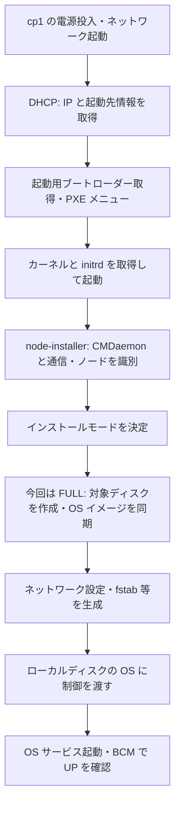

# BCM による PXE・OS プロビジョニング

確認日: 2026-09-22～23（JST）。BCM ヘッドノード上の読み取り専用調査と、BCM 11 の製品資料、利用者提供ログに基づく。node001～003 の MAC 登録・UP の提供結果に続き、[3 台の直接確認](#2026-09-23-node001003-の-bcm-からの一括確認) で FULL 同期完了、SSH、OS 内部、外部 HTTPS を確認した。ワーカー 3 台の展開とディスク変更の代替案は未実行。実際の進捗は [検証状況](validation.md)、実測構成は [環境構成](environment.md#2026-09-23-node001003-の直接確認) を参照する。

## 今回確認した前提

- CMDaemon、DHCP、DNS、HTTP、NFS が稼働。TFTP は `tftpd.socket` が UDP 69 を待ち受け、UEFI 用の `syslinux.efi` も存在する。`tftpd.service` 単体の `inactive` はソケット起動待ちの状態と区別する。
- `default-image` が存在し、カーネルは `6.8.0-106-generic`、ロックなし。ヘッドに `boot` と `provisioning` ロールがある。9 月 23 日の一括確認で node001～003 の FULL 同期完了と起動後の OS を直接確認した。ワーカー 3 台は未展開。
- 初回調査では全台 MAC 未登録だったが、9 月 23 日の実機確認では node001 が UP。後続の利用者提供一覧では node002 の MAC 登録・INSTALLING を確認し、さらに UP への移行を確認した。その後 node003 も MAC 登録・UP を提供ログで確認し、node004～node006 は MAC 未登録・DOWN / unassigned。初回の `device newnodes` に待機中のノードはなかった（後続調査では未再照会）。BCM の一覧だけで VM の電源状態は断定しない。
- 9 月 22 日夜に [ライセンス登録](bcm-licensing.md) を完了し、ヘッドを含む 7 台を扱えることを確認した。現在値は [検証状況](validation.md) を参照。最初の 1 台を確認してから残りへ進む順序は、展開設定を確かめるために維持する。
- ヘッドの NIC と MAC の対応は、利用者提供の libvirt 出力と照合済み。当初資料の MAC 対応を訂正し、現在の NIC 設定は維持する。cp1 の同一内部ネットワークへの接続定義と停止状態も確認した。詳細は [仮想化ホスト側の確認](environment.md#仮想化ホスト側の接続確認) を参照。
- `default` カテゴリは `newnodeinstallmode=FULL`、`installmode=AUTO`。新規ノードはディスクの再作成を伴う。`AUTO` も不一致時には `FULL` になるため、データ保護の代わりにはならない。

## PXE と FULL 展開の仕組み

### FULL は何をするか

FULL は、`disksetup` で選ばれた展開対象ディスクのパーティションを再作成し、ファイルシステムを作成して、ソフトウェアイメージを同期するインストールモード。対象領域の既存データは失われる。今回の OS ディスクは cp1 の `vda`、展開元は `default-image`（`/cm/images/default-image`）。ISO を各ノードで対話インストールする方式ではなく、BCM が管理する OS ファイル群を配布する。qcow2 全体をブロック単位で複製する方式とも異なる。

FULL の対象はディスク設定に基づく。同じ `<device>` に列挙した `<blockdev>` は候補であり、全候補・全接続ディスクを一律に消す意味ではない。ただし誤ったディスクを選べばそのデータを失うため、ワーカーの TopoLVM 用ディスクとの識別が必要。FULL 同期時の除外リストはコピー対象を制御するもので、再パーティション化から既存データを守るものではない。根拠: Admin Manual §5.4.4 pp.276–280、§5.4.7 pp.282–285、§D.3.1 p.953。

### 電源投入から UP まで

PXE（Preboot Execution Environment）は、ローカル OS がまだ動いていない段階で、ネットワークから起動用プログラムを取得する仕組み。BCM の OS 展開は、その後に起動する node-installer が担当する。



| 段階・構成要素 | 役割と今回の対応 |
|---|---|
| libvirt の内部ネットワーク | ヘッドと cp1 を接続する L2。libvirt の DHCP 定義はなく、BCM が起動情報を提供する |
| DHCP / 初期 TFTP | ノードのネットワーク起動を開始させる。BCM ヘッドは boot ロールを持つ |
| カーネル / initrd | node-installer を動かす一時的な起動環境。この環境の `bootloaderprotocol` は HTTP。マニュアルでは x86_64 の初期 PXE は TFTP、その後のカーネル・RAM ディスク取得で HTTP へ切り替わると説明する |
| CMDaemon / ノード定義 | 証明書を用いた通信、MAC 等によるノード識別、カテゴリ・IP・イメージ・ディスク設定の取得。今回の `Confirm node` 画面がこの識別に対応 |
| provisioning ロール / rsync | OS 本体のファイル群をローカルディスクへ同期する。今回の同期ログで rsync による FULL 展開を確認。イメージ全体を TFTP や NFS だけでコピーしたと解釈しない |
| 設定生成 / OS 起動 | node-installer がネットワーク設定・`fstab` 等を用意し、ローカルの `/sbin/init` へ制御を渡す。起動後画面と UP を確認済み。OS 内部の最新確認結果は [検証状況](validation.md) を参照 |

`default-image` はノードに配置する OS の内容、`disksetup` は配置先ディスクの構造、`installmode` は起動時にどの程度作成・同期するかという方針である。`BOOTIF` は起動に使った NIC を表す BCM 側の指定で、`[prov]` はイメージ転送用インターフェイスを示す。今回 node-installer 上での NIC 名は `enp1s0`。

上表の通信経路はマニュアルと取得設定に基づく説明で、今回パケットキャプチャによって各プロトコルの使用を実測したものではない。根拠: §5.1.1 pp.239–242、§5.1.6–5.2 pp.243–244、§5.4 pp.261–264、§5.4.7–5.4.9 pp.282–287、§5.4.13–5.5 pp.290–292。

### AUTO を選んだのに FULL になる理由

PXE メニューの `AUTO` は、毎回ディスクを温存すると約束する指定ではない。BCM は新規ノード用の設定や、次回起動用・ノード単位・カテゴリ単位のモード設定も参照して動作を決める。

今回のカテゴリ設定は `newnodeinstallmode=FULL`、通常の `installmode=AUTO`。マニュアル §5.4.4 pp.278–279 では、新規ノードと判定された場合のカテゴリ設定を先に調べると説明する。また、通常の AUTO でも既存ディスクの構造が設定と合わない、または破損していれば FULL を実施する。したがって、初回 PXE メニューの AUTO → node-installer の FULL は正常に起こり得る。

画像と同期ログから今回 FULL が実行されたことは確定している。一方、新規ノード判定・ディスク不一致のどちらの分岐が直接の決定理由だったかは、取得した証跡だけでは確定していない。設定と初回展開の状況に整合する説明として扱う。

| インストールモード | node-installer の処理 | 再初期化の可能性 |
|---|---|---|
| FULL | パーティション・ファイルシステムを作り直し、OS イメージを同期 | あり。通常のディスク展開では既存内容を失う |
| AUTO | レイアウト・ファイルシステムを検査。正常なら差分同期、不一致・破損なら FULL | あり |
| NOSYNC | 検査に問題がなければイメージ同期を省略。欠落したノード証明書・鍵の補充は例外 | 不一致等で FULL になり得る |
| SKIP | パーティション・ファイルシステムの検査とイメージ同期を省略 | このモードでは再作成しない。既存 OS が起動できる保証ではない |
| MAIN | ディスク検査・展開を行わず保守モードへ入る | このモードではディスクに手を加えない |

この表はモードとして決定された後の処理を説明する。モードは node-installer 実行時のもので、稼働中のノードに対する `imageupdate` を止める設定ではない。`nextinstallmode` は次回起動用であり、通常の恒常設定と区別する。根拠: §5.4.4 pp.276–279。

### 次回起動と Kubernetes / TopoLVM への影響

BCM は導入後も通常はネットワーク起動でノードを管理する。**PXE 起動すること自体と、毎回 FULL 再インストールすることは同義ではない。** 通常の AUTO でディスク検査が正常なら、パーティションの再作成をせずイメージとの差分を同期して OS を起動する。ただし同期対象では、イメージにないローカルファイルが削除されることもある。

そのため Kubernetes 導入後は、ノードにだけ加えた設定、etcd や kubelet のデータ等を BCM の再同期でどう扱うかを決める必要がある。`excludelistsyncinstall` は通常同期の対象制御に関係するが、FULL 時のディスク初期化の保護策にはならない。TopoLVM 用追加ディスクの識別・展開対象外の維持も別途必要。必要な保護対象パスと除外設定は後続の Kubernetes 構築時に確定し、この説明だけで設定済みとはしない。

マニュアルには FULL 前の確認を求める `datanode` や XML assertion の仕組みもある（§5.4.4–5.4.6 pp.279–281、付録 D.11）。今回はこれらを追加設定していない。ローカルディスクだけからの独立起動へ変更するにはブートローダー・起動順・BOOTIF 等の整合が必要であり、単に PXE を無効にする手順にはしない（§5.4.10 pp.287–289）。

## 1. 仮想化ホストで接続とディスクを確認する

以下は **KVM / libvirt 物理ホスト上**の読み取り専用コマンド例。BCM VM 上では実行しない。VM が動いている場合は現在の構成と永続構成の両方を照合する。

```bash
virsh domiflist tk8s-bcm
virsh domiflist tk8s-bcm --inactive
virsh domiflist tk8s-cp1
virsh domstate tk8s-cp1
virsh domblklist tk8s-cp1 --details
virsh domblkinfo tk8s-cp1 vda
virsh dumpxml tk8s-cp1
virsh net-dumpxml tk8s-internal
```

確認条件:

- BCM の **実際の内部インターフェイス `enp1s0`** と、対象ノードの PXE NIC が同じ `tk8s-internal` / `tk8s-int` に接続されること。MAC 対応は [環境構成](environment.md#2026-09-22-の稼働後確認) を使う。資料の MAC 名称だけを理由に BCM の NIC 設定を交換しない。
- `tk8s-internal` で libvirt の DHCP が動作せず、BCM だけが DHCP を提供すること。
- `tk8s-cp1` の内部 NIC の MAC が計画と一致すること。UEFI・Secure Boot 無効、内部 NIC のネットワーク起動を優先すること。
- `tk8s-cp1` の OS ディスクが virtio の `vda`、容量 128 GiB であること。対象ディスクの内容は展開で消去される。
- ワーカーは `domblklist` と XML で OS 用と TopoLVM 用のバックエンドを識別する。両方 256 GiB のため、容量だけでは識別できない。追加ディスクが `vdb` であることも推測で決めない。

2026-09-22 の利用者提供出力で、BCM の内部・外部 NIC と cp1 の接続、cp1 の停止状態、`vda` 1 台、内部ネットワークの DHCP 定義なしを確認した。ヘッドの接続は実測と一致し、NIC 設定の交換は不要。後続の `domblkinfo` で Capacity 137438953472 bytes = 128 GiB を確認した。起動設定・ヘッドの永続構成は今回の出力では未確認なので、残る確認を上のコマンドや VM 設定画面で行う。`domblkinfo` の Capacity は仮想容量であり、qcow2 の実消費量とは区別する。本調査では物理ホストへの接続・修正は行っていない。

## 2. 最初の 1 台を BCM の既存定義へ登録する

以下の MAC 登録は、利用者が **BCM ヘッドノード上**で実行済み。後続の読み取りで保存を確認したため、`node001` への再実行は不要。別ノードに適用する際は手順 1 で MAC が一致することを確認し、対象 VM が停止している状態で行う。MAC 登録後は起動したノードの展開が進み得る。

最初は VM `tk8s-cp1` を既存定義 `node001` に対応させる。VM 名と BCM 内のホスト名は別であり、この手順では改名しない。割り当て表は [環境構成](environment.md#2026-09-22-の稼働後確認) を参照する。

```bash
# 読み取り: MAC 未登録・対象定義・カテゴリを再確認
cmsh -c 'device list'
cmsh -c 'category use default; get softwareimage; get newnodeinstallmode; get installmode; get disksetup'

# 設定変更: tk8s-cp1 の内部 NIC を node001 に対応付ける
cmsh -c 'device use node001; set mac 52:54:00:65:00:02; commit'

# 読み取り: node001 の BOOTIF は計画どおり 172.30.65.11 であること
cmsh -c 'device; interfaces node001; list'
```

`set mac`、インターフェイスの `set ip` は実機の `help set` で項目名を確認した。エージェントは設定を変更せず、利用者が実行した `node001` の MAC 登録を読み取りで確認した。

## 3. OS ディスクと swap の扱いを確認する

### ディスク候補の意味

同じ `<device>` 内の複数の `<blockdev>` は探索順の候補であり、全部を初期化する指定ではない。BCM 11 Admin Manual §D.3.1 p.953 では、`sda` → `hda` → `vda` 等の順に試すと説明している。今回の cp1 は `vda` 1 台なので、既存候補を残したまま展開できる構成であり、`vda` だけに絞ることは必須ではない。

ワーカーでは OS と TopoLVM 用ディスクの対応を確認する。対象を明示するなら、各ノードの `disksetup` の候補を、実際に識別した OS ディスク（例: `<blockdev>/dev/vda</blockdev>`）だけにする。クラウド用候補に `vdb` があることだけで通常の KVM 展開で `vdb` も消去されるとは判断しない。ノード単位の設定はカテゴリより優先される。

### Kubernetes と swap

本検証の通常構成では、Kubernetes 用 6 台で swap が無効なことを構築時・再起動後に確認する。Linux の kubelet は既定では有効な swap があると起動しないが、swap を許可する明示的な設定もある。swap パーティションの存在と、OS がそれを有効化している状態は別である。[Kubernetes 公式資料](https://kubernetes.io/docs/concepts/cluster-administration/swap-memory-management/) を参照。

**インストール済み BCM の `cm-kubernetes-setup` には、計算ノードの swap を無効化する処理がある。** 調査対象は [環境構成](environment.md#2026-09-22-の稼働後確認) に記録した `cm-setup` の版。

- `GetNodesWithSwap` は対象ノード・カテゴリの `disksetup` から `linux swap` を検出し、ヘッドノードを除外する。
- セットアップの処理列に `DisableSwapOnComputeNodes` が含まれ、検出したノードへ `swapoff -a` を実行する。
- 同クラスのコメントには、KubernetesNodeRole 設定後は node-installer が処理すると記載されている。これは実装上の説明で、今回その再起動動作を実証したものではない。
- kubeadm 用テンプレートには `failSwapOn: false` がある。したがって kubelet の起動成功だけでは swap 無効の証明にならない。

BCM のセットアップを使う場合は、現在の swap 16G を含むレイアウトで OS を展開し、Kubernetes 構築時に BCM の無効化処理と実際の swap 状態を確認する進め方が可能。PXE 前の swap パーティション削除は必須ではない。先の「swap の定義を保持」という案内はこの条件の説明が不足していたため補足した。手動 kubeadm 等を選ぶ場合は、BCM の自動処理が実行される前提にせず、対象ノードの swap と起動時の有効化設定を別途管理する。

### 任意: 初回 PXE から swap パーティションを作らない場合

16G をルート領域へ回したい場合は、初回展開前に swap 定義を除く方法もある。次は **未実行の代替手順**。BCM ヘッドノード上で、`device list` により `default` の対象が Kubernetes 用 6 台であることを確認し、停止中に編集する。

```text
cmsh
category use default
set disksetup
```

エディターで次のブロックだけを削除し、EFI と XFS `/`、ディスク候補を保持する。`a2` の採番変更は不要。

```xml
<partition id="a1">
  <size>16G</size>
  <type>linux swap</type>
</partition>
```

保存後に確認し、BCM 設定をコミットする:

```text
get disksetup
commit
quit
```

`cmsh -c 'device use node001; get disksetup'` で継承結果を確認する。他の 5 台もノード独自の上書きがないことを確認する。カテゴリ変更は継承するノードに及び、ヘッドの既存パーティションは変更しない。設定の `commit` と Git コミットは別であり、実ディスクへの反映は node-installer の展開時。OS 展開後にレイアウトを変えると `AUTO` でも再初期化を招く可能性があるため、初回展開前の選択肢として扱う。

なお、今回のソフトウェアイメージの `/etc/fstab` には `/swap.img` の swap エントリーがあった。swap パーティションを削除するだけで swap ファイルも無効になったとは判断しない。node-installer が生成・調整した後の実ノードの `fstab` と `swapon` を確認する。BCM の前述の検出はディスク XML を見るため、swap ファイルだけの構成でも同じ検出が働くと仮定しない。

## 4. tk8s-cp1 だけを PXE 起動する

cp1 は 2026-09-23 に初回展開・起動を確認済み。以下は再現用の手順であり、確認済みの cp1 を再展開する必要はない。実際に使った VM 起動コマンドとキー操作は未記録。

**仮想化ホスト上**で、停止中の対象 VM を起動する。ネットワーク優先の UEFI 起動順が設定済みであることが前提。

```bash
virsh start tk8s-cp1
```

noVNC 等の VM コンソールで、内部 NIC の **UEFI IPv4 PXE** を選択し、DHCP → ブートローダー → カーネル・initramfs → BCM node-installer → OS 展開の順に確認する。ISO インストーラーを再度起動する必要はない。

BCM の PXE メニューでは通常の `AUTO` を使用する。新規ノードにはカテゴリの `FULL` が適用されることを理解し、対象 VM・OS ディスクの確認を済ませておく。全台に `FULL` を永続設定する必要はない。

今回の `Confirm node` 画面では登録済みの `node001`、MAC、BOOTIF の IP が表示された。内容が対象 VM と一致することを確認して `Accept` で進む。画像は選択状態とカウントダウンを示しており、手動決定か自動進行かは未記録。

未知ノードの選択画面で停止したら、コンソールの MAC と `node001` に登録した MAC を再確認する。必要なら BCM 上で `cmsh -c 'device newnodes'` を実行する。MAC が期待した 1 台に一致するときだけコンソールの `Manually select node` で `node001` を選択する。出現順だけで一括割り当てしない。

## 5. 展開と起動を確認する

**BCM ヘッドノード上**の監視例。ログは起動処理が進んでから作られる場合がある。

```bash
journalctl -u dhcpd -f
tail -F /var/log/node-installer /var/log/cmdaemon
```

別端末で確認する:

```bash
cmsh -c 'device list'
cmsh -c 'device synclog node001'
ping -c 3 172.30.65.11
ssh root@node001
```

SSH は BCM ヘッドからホスト名 `node001` を使う。2026-09-23 に既存ホスト鍵の照合と公開鍵認証で接続できた（[確認記録](#2026-09-23-ホスト名による-ssh-と-os-内部の確認)）。IP 指定時の未登録ホスト鍵エラーとは区別する。SSH では接続先ホスト鍵を確認する。ヘッドに設置した利用者の SSH 公開鍵が、ソフトウェアイメージや計算ノードにも配布済みとは限らない。ログインできない場合は鍵配布と sshd の設定を別途確認する。

**展開後の node001 上**で確認する:

```bash
hostname
cat /etc/os-release
ip -br addr
ip route
lsblk -o NAME,SIZE,TYPE,FSTYPE,MOUNTPOINTS
swapon --show
free -h
findmnt --fstab --types swap
systemctl --failed
getent ahostsv4 docs.nvidia.com
```

合格条件は、BCM の `UP` 表示、OS 展開ログに致命的エラーなし、期待した IP、OS ディスクからの稼働、管理ログイン、必要な名前解決・外部通信の確認。ヘッド側の NAT 設定があるだけでは、計算ノードからの外部疎通成功とはしない。

OS 展開段階では、既存レイアウトを維持した場合に swap が有効でも Kubernetes 構築前の状態として記録する。Kubernetes 構築後は、各ノードで `swapon --show` が空、`free -h` の Swap 合計が 0 であることを確認し、再起動後にも再確認する。パーティションを残して無効化した場合、`lsblk` に swap の署名が見えること自体は失敗ではない。swap が残る場合は kubelet 起動成功だけで完了にしない。

DHCP 応答がなければ内部 L2 接続・競合 DHCP・ファイアウォールを確認する。DHCP まで進み TFTP で停止する場合は、UEFI 用ファイル、UDP 69、TFTP の後続通信とサーバーログを確認する。イメージ転送段階なら NFS・provisioning ロール・`device synclog` を確認する。

## 6. 最初の 1 台の確認後に残り 5 台へ進む

作業順は cp2 → cp3 → ワーカー 3 台。node001～003 は [BCM からの直接確認](#2026-09-23-node001003-の-bcm-からの一括確認) で同期ログ・SSH・OS 内部・外部通信まで確認済み。現在は **6.4 のワーカー 3 台のディスク識別と展開準備へ進む**。登録・起動済みの VM を再展開せず、以下の事前確認・登録手順は未展開ノードへの適用時に参照する。VM・MAC・IP の正本は [環境構成](environment.md#2026-09-22-の稼働後確認)、容量は [VM 一覧](vm-list.md) を参照する。

ヘッドを含む 7 台を扱えるライセンスは適用・確認済み。期間を空けて作業する場合は `cmsh -c 'main licenseinfo'` と `verify-license verify` で再確認する。出力にはライセンス識別情報があるため、そのまま公開しない。

### 6.1. cp2 の接続・ディスク・起動設定を確認する

**KVM / libvirt 物理ホスト上**で、対象 VM を管理できる権限で実行する。BCM ヘッド上のシェルとは区別する。

```bash
virsh domstate tk8s-cp2
virsh domiflist tk8s-cp2 --inactive
virsh domblklist tk8s-cp2 --inactive --details
virsh domblkinfo tk8s-cp2 vda
virsh dumpxml tk8s-cp2 --inactive
virsh domiflist tk8s-bcm
virsh domiflist tk8s-bcm --inactive
virsh net-dumpxml tk8s-internal
```

期待結果は cp2 が停止中、内部 NIC が環境構成の MAC と一致し `tk8s-internal` に接続、OS ディスクが `vda` 1 台・128 GiB であること。`domblklist` で `vda` が見つからなければ後続へ進まず、ディスクの対応を確認する。XML と VM 設定画面で UEFI・Secure Boot 無効・内部 NIC の PXE 優先も確認する。ヘッドの現在・次回起動時の内部接続が一致し、内部ネットワークに libvirt の DHCP 定義がないことを照合する。

`--inactive` は次回起動に使う定義を確認する指定（[libvirt virsh 公式資料](https://www.libvirt.org/manpages/virsh.html#domiflist)、同 `domblklist` / `dumpxml` 節）。物理ホストの libvirt バージョンは未記録。既に稼働中なら、上書き登録・強制停止をせず、現在の構成と展開済みかを先に確認する。

### 6.2. cp2 を登録して PXE 起動する

**BCM ヘッドノード上**の管理者シェルで実行する。まず読み取りで対象・カテゴリ・ディスク設定を照合する。

```bash
cmsh -c 'device list'
cmsh -c 'category use default; get softwareimage; get newnodeinstallmode; get installmode; get disksetup'
cmsh -c 'device use node002; get category; get disksetup; get installmode; get nextinstallmode'
cmsh -c 'device; interfaces node002; list'
```

`node002` が未展開・MAC 未登録で、カテゴリ `default`、イメージ `default-image`、BOOTIF が環境構成の cp2 用 IP / `internalnet` であることを確認する。ノード固有の上書きがある場合はカテゴリ設定だけで展開動作を判断しない。ディスク設定は [手順 3](#3-os-ディスクと-swap-の扱いを確認する) に従い、実際の OS ディスクに適用されることを確認する。

物理ホストで内部 MAC が一致し、cp2 が停止中であることを確認できた場合に登録する。次の MAC は環境構成の公開可能な検証用値。後続の利用者提供ログで一致と登録を確認済みのため、現在の cp2 に再実行する必要はない。

```bash
cmsh -c 'device use node002; set mac 52:54:00:65:00:03; commit'
cmsh -c 'device list'
cmsh -c 'device; interfaces node002; list'
```

**物理ホスト上**で cp2 だけを起動する。新規ノードの FULL 展開は OS ディスクを初期化するため、対象に保存すべきデータがないことが前提。

```bash
virsh start tk8s-cp2
```

VM コンソールで内部 NIC の UEFI IPv4 PXE → `AUTO` → `Confirm node` と進む。`node002`・登録 MAC・BOOTIF の予定 IP が一致するときだけ `Accept` で進める。違うノードが表示されたら進めない。識別できない場合は [手順 4](#4-tk8s-cp1-だけを-pxe-起動する) の MAC 照合を行う。

### 6.3. cp2 の起動後を確認して cp3 へ進む

**BCM ヘッドノード上**で同期ログと状態を確認し、同期完了・`UP` とコンソール上の OS 起動を確認してから SSH 接続する。INSTALLING の間は進行を確認し、表示が変わらない場合は時間を空けた同期ログとコンソールのエラーを照合する。

```bash
cmsh -c 'device list'
cmsh -c 'device synclog node002'
ssh root@node002
```

SSH のホスト鍵が未登録なら、VM コンソールで指紋を取得して照合してから登録する。node001 で成功したことは他ノードの鍵登録・認証成功を保証しない。確認方法とノード内部のコマンドは [手順 5](#5-展開と起動を確認する) を適用し、以下も **接続先 node002 上**で実行する。

```bash
findmnt -no SOURCE,FSTYPE /
curl -4 -I --connect-timeout 5 --max-time 15 -sS -o /dev/null -w 'HTTPS status: %{http_code}\n' https://docs.nvidia.com/
```

期待するノード名・IP、OS ディスク上のルート、`UP`、同期完了、失敗サービスなし、外部名前解決と HTTPS 接続を確認して記録する。失敗時は出力と終了コードを保存して原因を確認する。この段階の swap 有効は既存構成として記録し、Kubernetes 構築後・再起動後に無効化を確認する。

合格後、6.1～6.3 の VM を `tk8s-cp3`、BCM 名を `node003` に置き換えて繰り返す。登録 MAC・確認 IP は環境構成の cp3 行を用い、cp2 の値を流用しない。

### 6.4. ワーカーの追加ディスクを保護して展開する

各ワーカーにも 6.1 の読み取り確認を適用する。OS 用と TopoLVM 用はどちらも 256 GiB のため、容量だけで判断せず、`domblklist` のバックエンドと XML の `source` / `target` を作成時の用途と照合する。追加ディスクを `vdb` と推測しない。用途を確定できない場合は PXE 起動を保留する。

**BCM ヘッドノード上**で、停止中の対象ノードの `disksetup` を [手順 3](#ディスク候補の意味) に従って確認する。OS ディスクに限定する必要がある場合は対象ノードだけを編集し、`get disksetup` で追加ディスクが初期化対象に含まれないことを確認してから `commit` する。共有カテゴリの不用意な変更は避ける。

各 VM の内部 NIC の MAC を実接続と照合してから、手順 2 と同様に `node004`～`node006` へ登録する。Multus 側の MAC を登録しない。

ワーカーは現在の連続 IP を計画に合わせて変更する。以下は **BCM ヘッドノード上**の未実行例（VM が停止中、既存の IP 使用がないことを確認した後）。

```bash
cmsh -c 'device; interfaces node004; use BOOTIF; set ip 172.30.65.21; commit'
cmsh -c 'device; interfaces node005; use BOOTIF; set ip 172.30.65.22; commit'
cmsh -c 'device; interfaces node006; use BOOTIF; set ip 172.30.65.23; commit'
```

展開対象ディスクと対応を確認した台から順に PXE 起動し、各台の結果を記録する。ワーカーの Multus 用 NIC を PXE NIC として登録しない。OS 起動後に追加ディスクが未初期化のまま残っていることを確認し、LVM / TopoLVM 作業は後続で行う。

Kubernetes 等を導入した後は、BCM イメージとの同期や再展開時の除外設定も検討する。`AUTO` や `NOSYNC` という名前だけでローカル変更・データが保持されると判断しない。

作業日時・実行者・対象ノード・コマンドと画面操作・結果・失敗箇所を各台ごとに記録し、原本は `input/` に保存する。XML に含まれる実パスや UUID、SSH 指紋、ライセンス識別情報は公開文書へそのまま転記しない。6 台の合格を確認した時点で [検証状況](validation.md) を更新し、Kubernetes の役割配置・アドレス設計の確定へ進む。

## 2026-09-22: 容量・登録結果・swap の調査記録

目的は利用者が実行した MAC 登録の確認と、PXE 前のディスク変更の要否の判断。利用者の `domblkinfo` と MAC 登録・`get disksetup` 出力を確認した後、BCM ヘッド上の管理権限で次の読み取りを実行した。

```bash
cmsh -c 'device list'
cmsh -c 'device use node001; get mac; get disksetup'
cmsh -c 'category use default; get disksetup'
cmsh -c 'device; interfaces node001; list'
rg -n 'swap' /cm/images/default-image/etc/fstab
command -v cm-kubernetes-setup
rg -n -i 'swapoff|failswapon|swapbehavior' /cm/local/apps/cm-setup --glob '*.py' --glob '*.j2'
```

検索で特定した `cmsetup/plugins/kubernetes/` 配下の `stages/stages.py`、`plugin.py`、`consts.py`、`templates/kubeadm-init.yaml.j2` を読み、swap の検出条件・無効化処理・呼び出し・テンプレート値を照合した。補助として node-installer と htdocs/scripts の Python / shell ファイルを検索したが、再起動時の無効化の全実装は追跡できていない。ローカル PDF は一時領域の pypdf で抽出して Admin Manual §D.3.1–D.3.3 を確認し、Containerization Manual 内の swap 検索では OS swap の説明を確認できなかったため、上記の実装と Kubernetes 公式資料を根拠とした。抽出物はリポジトリ外の一時領域に置いた。

期待した MAC 保存と BOOTIF の維持を確認。`disksetup` は引き続きカテゴリ継承で swap 16G を含む。容量の判断と対応表は [環境構成](environment.md#仮想化ホスト側の接続確認)、進捗は [検証状況](validation.md) を参照。エージェントは BCM 設定変更・VM 起動・swap 無効化・Kubernetes 構築を行っていない。再起動後の swap 状態と、展開後の `fstab` は未確認。匿名化した観測記録は `input/40-bcm-pxe/2026-09-22-cp1-swap-review.txt`。

文書更新では、本書・環境構成・検証状況を編集し、相対リンク・コードブロック・差分を確認する。[保守手順](repository-maintenance.md#保存前の確認コミット手順) の公開情報確認をこの 3 ファイルに適用し、公開用の汎用名義でローカルコミットする。証跡は Git 差分・履歴。実環境の成功確認とは区別する。

## 2026-09-23: node001 の初回 PXE・OS 展開記録

### 対象・前提・利用者の実施結果

対象は `tk8s-cp1` / `node001`。前日までにライセンス登録、内部 NIC の MAC 登録、OS ディスク `vda` 128 GiB を確認していた。利用者が VM の起動・展開を実施し、`input/60-install-by-pxe/` に画像 4 枚を提供した。仮想化ホストで使ったコマンド、コンソールのキー操作、撮影端末のタイムゾーンは未記録。以下の画像時刻はファイル名の表記を使用する。BCM ログ時刻は JST。

| 順序 | 画像（すべて `input/60-install-by-pxe/` 配下） | 確認できた画面・結果 |
|---|---|---|
| 1 | `スクリーンショット 2026-09-23 000636.png` | PXE メニューで `AUTO` が選択され、自動起動のカウントダウンを表示 |
| 2 | `スクリーンショット 2026-09-23 000659.png` | `Confirm node` に `node001`、`default`、登録 MAC、`BOOTIF [prov]` と予定 IP、`internalnet` を表示。`Accept` が選択状態。スイッチポート・ロールは未設定表示 |
| 3 | `スクリーンショット 2026-09-23 000711.png` | `enp1s0` が予定 IP `/24` を使用し、ネットワーク設定終了、インストールモード `FULL`、ディスク設定取得へ進行。node-installer の表示版は `165270_14a0291f4f` |
| 4 | `スクリーンショット 2026-09-23 000948.png` | 起動後の Node Info。Ubuntu 24.04.4 LTS、BCM 11.0、`node001`、カーネル `6.8.0-106-generic`。認識リソースは [環境構成](environment.md#2026-09-23-node001-の起動後確認) に集約 |

PXE メニューの `AUTO` と node-installer の `FULL` は矛盾しない。前者で通常起動し、新規ノードの展開にはカテゴリの `newnodeinstallmode=FULL` が適用された結果と整合する。画面 3 の NVMe multipath 検出は機能無効・検出スクリプト exit 1 の表示で、その後ディスク設定取得へ進んでいるため、この表示だけで展開失敗とは判断しない。

利用者の `device list` 出力では `node001` が `UP`、残り 5 台が `DOWN, unassigned`。OS 展開後の情報画面と合わせて、最初の 1 台の OS 起動までを確認した。画面だけで UEFI / Secure Boot 設定、マウント元、swap 状態、管理ログイン・外部疎通の成功は断定しない。

### ヘッドノード上での読み取り確認

管理権限で 00:10～00:11 JST に以下を実行し、利用者の結果と照合した。新しいソフトウェアの導入、設定変更、VM 起動・再起動は行っていない。

```bash
cmsh -c 'device list'
cmsh -c 'device synclog node001'
```

`node001` の `UP` を再確認。同期ログには 00:07:26 の `FULL` 開始、00:08:19 の rsync 完了が記録されていた。通常ファイルの転送数は 178,007、転送対象ファイルの合計サイズは 10,591,430,477 bytes。初回のログ出力はファイル一覧が大量で表示が省略されたため、Python の `subprocess.run` で再取得し、開始・終了時刻と上記統計だけを抽出して保存した。全ログを精読したとの扱いにはしない。

続いて次の SSH 調査を試行した。実行場所は BCM ヘッドノード、対象は `node001`。

```bash
ssh -o BatchMode=yes -o StrictHostKeyChecking=yes -o ConnectTimeout=8 root@172.30.65.11 'hostname; uname -r; ip -br addr; ip route; findmnt -no SOURCE,FSTYPE /; lsblk -o NAME,SIZE,TYPE,FSTYPE,MOUNTPOINTS; swapon --show; free -h; systemctl --failed --no-pager; getent ahostsv4 docs.nvidia.com'
```

結果は終了コード 255。接続先 IP に対応する ED25519 ホスト鍵が未登録のため、ホスト鍵検証で停止した。ユーザー認証前の停止であり、パスワード・公開鍵認証の失敗を示すものではない。引用符内のノード上コマンドは未実行。`known_hosts` の変更や検証の無効化は行っていない。抽出ログと失敗理由は `input/60-install-by-pxe/2026-09-23-post-pxe-check.txt` に保存した。

### 初回調査時点の残課題と記録の保存

以下は IP 指定の SSH が停止した時点の案内。後続の [ホスト名接続の確認](#2026-09-23-ホスト名による-ssh-と-os-内部の確認) で SSH・OS 内部・外部疎通の確認は完了したため、コンソールでのホスト鍵登録は今回不要になった。

VM コンソールの Node Info 画面から `Alt+F2` でコンソールを開き、管理者としてログインして [手順 5](#5-展開と起動を確認する) のノード上コマンドを実行する。SSH を使う場合は、コンソールで `ssh-keygen -lf /etc/ssh/ssh_host_ed25519_key.pub` により指紋を取得し、ヘッドからの接続時に表示される指紋と照合して登録する。これは次の未実行手順である。

cp1 のルートのマウント元、実パーティション、swap、失敗サービス、名前解決・外部疎通を確認してから残り 5 台へ進む。現在の 16G swap 定義を構築後に削除するためだけのレイアウト変更は行わず、[Kubernetes と swap](#kubernetes-と-swap) の扱いを引き継ぐ。R-01 全体は 6 台が対象なので、今回の 1 台の起動だけで完了にはしない。

文書整理は本書・環境構成・検証状況を対象とし、画像を個別に目視確認して要約した。画像原本とログは `input/` に保持する。公開可否未確認のヘッド実ホスト名は転記しない。[保守手順](repository-maintenance.md#保存前の確認コミット手順) に従い、この 3 文書のリンク・コードブロック・ステージ済み差分・公開情報を確認してローカルコミットする。証跡は本節、Git 差分・履歴と上記画像・抽出ログ。OS 内部の確認と残り 5 台の展開は未完了。

## 2026-09-23: ホスト名による SSH と OS 内部の確認

利用者から `ssh node001` でログインできるとの報告を受け、00:17 JST に BCM ヘッドの root シェルから再確認した。前回の IP 指定の失敗を、ホスト名指定でも接続できないという意味には扱わない。対象は展開済み `node001`、OS / カーネルは [環境構成](environment.md#2026-09-23-node001-の起動後確認) のとおり。

まず以下を実行した。`BatchMode=yes` で対話認証を避け、`StrictHostKeyChecking=yes` でホスト鍵検証を維持した。

```bash
ssh -o BatchMode=yes -o StrictHostKeyChecking=yes -o ConnectTimeout=8 node001 'hostname; uname -r; ip -br addr; ip route; findmnt -no SOURCE,FSTYPE /; lsblk -o NAME,SIZE,TYPE,FSTYPE,MOUNTPOINTS; swapon --show; free -h; findmnt --fstab --types swap; systemctl --failed --no-pager; getent ahostsv4 docs.nvidia.com'
```

SSH は終了コード 0。ノード名・予定 IP、ディスク上のルート、実パーティション・有効な swap、失敗ユニットなし、外部名の解決を確認した。実測値は [環境構成](environment.md#2026-09-23-node001-の起動後確認) に集約。前回ソフトウェアイメージ内にあった `/swap.img` エントリーに対し、展開後ノードの `fstab` の swap 行はパーティションを指す UUID 形式で、`swapon` にも `/dev/vda2` のみが表示された。UUID の実値は公開文書へ転記しない。

次に認証方式と外部 HTTPS 到達性を確認した。

```bash
ssh -v -o BatchMode=yes -o StrictHostKeyChecking=yes -o ConnectTimeout=8 node001 'id -un; curl -4 -I --connect-timeout 5 --max-time 15 -sS -o /dev/null -w "HTTPS status: %{http_code}\n" https://docs.nvidia.com/'
```

既存の `/root/.ssh/known_hosts` にある `node001` の ED25519 ホスト鍵に一致し、`publickey` 認証で root として接続した。どの操作でホスト名の鍵が登録されたかは今回調査していない。鍵の追加・削除、SSH 設定変更、検証の無効化は不要だった。`curl` は終了コード 0、HTTP 200。確認範囲はこの宛先への IPv4 HTTPS 接続であり、全リポジトリ・全プロトコルの到達性を保証するものではない。

証跡は `input/60-install-by-pxe/2026-09-23-node001-os-check.txt` と `input/60-install-by-pxe/2026-09-23-hostname-ssh-check.txt`。後者は Python の `subprocess.run` で SSH の標準出力と、ホスト鍵照合・認証成功に関するデバッグ行のみを抽出して保存した。秘密鍵・公開鍵本文は記録していない。

これにより cp1 の初回展開後の基本確認を終え、[手順 6](#6-最初の-1-台の確認後に残り-5-台へ進む) に沿って残り 5 台の準備へ進める。swap は Kubernetes 構築前の現在有効であり、BCM による構築後・再起動後の無効化は今後確認する。今回、swap 無効化・ディスク変更・再起動は行っていない。

本書・環境構成・検証状況を更新し、[保守手順](repository-maintenance.md#保存前の確認コミット手順) に沿って 3 文書のリンク・コードブロック・ステージ済み差分・公開情報を確認してローカルコミットする。原本は `input/` のまま保持し、実 UUID・外部解決先アドレス・ホスト鍵の実値は文書へ転記しない。残課題は 5 台の展開、再起動検証と Kubernetes 構築以降の確認。

## 2026-09-23: PXE とインストールモードの説明調査

本書・README・製品資料索引を読み、ローカルの BCM 11 Admin Manual（Revision `47eff3c`、2026-09-21）を一時領域の pypdf で抽出し、上記説明に示す章・ページを確認した。公開版の取得も試したが、閲覧ツールのサイズ制限で取得できなかったため、今回の本文照合はローカル版を使用した。抽出物は `/tmp/` に置き、Git 対象にしない。

BCM ヘッド上の管理権限で、次の読み取りを行った（設定変更なし）。

```bash
cmsh -c 'category use default; get newnodeinstallmode; get installmode; get softwareimage; get bootloaderprotocol'
cmsh -c 'device use node001; get installmode; get nextinstallmode; get bootloaderprotocol'
```

カテゴリは順に FULL、AUTO、default-image、HTTP。node001 の installmode / nextinstallmode の出力は空欄、bootloaderprotocol は HTTP のカテゴリ継承表示だった。`/var/log/node-installer` の node001 行からモード決定・新規判定・ディスク不一致に関する限定検索も行ったが、該当出力がなく、FULL 決定の直接の分岐は特定できなかった。以前の同期ログ・画像は [初回展開記録](#2026-09-23-node001-の初回-pxeos-展開記録) を引き継ぎ、再展開・パケット取得・ノード内検証は行っていない。

本書に概念図・モード比較・今回の実測との対応を追記し、製品資料索引から参照できるようにした。公開前確認は [保守手順](repository-maintenance.md#保存前の確認コミット手順) を今回の 2 文書に適用する。証跡は Git 差分・履歴、上記ローカル資料、`input/60-install-by-pxe/2026-09-23-pxe-mode-check.txt`。未解決の実環境検証項目は [検証状況](validation.md) を維持する。

共有作業領域で別作業の変更も検出したため、一時 `GIT_INDEX_FILE` に `git read-tree` で HEAD を読み込み、今回の 2 文書の差分だけを `git hash-object` / `git update-index` で登録して確認した。共有インデックスはこの準備で変更していない。

## 2026-09-23: 次の作業手順の整理

目的は、node001 の確認済み範囲を踏まえ、次に利用者が実行する cp2 以降の手順を具体化すること。実行者は Codex（読み取り専用レビューのサブエージェントを含む）。作業場所はリポジトリのルートで、文書編集・ローカルコミットの権限を使用する。対象製品は既存記録の BCM 11 / Ubuntu 24.04、作業ツールは Git 2.43.0 / Python 3.12.3。`date -Iseconds` で 00:35 JST を確認した。操作ごとの時刻と編集ツールの版は未記録。

実行順と結果:

1. `pwd`、`git status --short --untracked-files=all`、`rg --files -g 'AGENTS.md' -g 'README.md' -g 'docs/**' -g '.gitignore'` で作業場所・開始時の変更なし・対象文書を確認した。README と AGENTS、検証状況・環境構成・VM 一覧・要件・PXE 手順・保守記録を `cat` / `sed -n` で読み、`rg -n` で関連見出し・未確認事項を検索した。関連するライセンス・Kubernetes バージョン文書の検索結果も確認した。一括表示の省略箇所は範囲指定で読み直した。`.gitignore` と `git log -3 --format='%h %s'` も確認した。
2. サブエージェントが同じ索引・方針と、検証状況・環境構成・VM 一覧・PXE 手順を `pwd`、`rg --files`、`cat`、`rg -n`、`sed -n` で独立確認した（終了コードはいずれも 0）。次の対象が残り 5 台であること、ワーカーの同容量ディスクの識別とホスト名 SSH の確認が必要なことを照合した。編集・実環境操作は委任していない。
3. `git --version`、`python3 --version`、`date -Iseconds` と `rg --files input/40-bcm-pxe input/60-install-by-pxe` を実行した。`sed -n` で `input/60-install-by-pxe/2026-09-23-node001-os-check.txt`、同 `2026-09-23-hostname-ssh-check.txt`、同 `2026-09-23-pxe-mode-check.txt` を確認し、既存の OS・SSH・HTTPS・モード設定の記録と照合した。公開可否未確認の UUID・解決先アドレス等は追記していない。
4. Web 閲覧ツールで [libvirt virsh 公式資料](https://www.libvirt.org/manpages/virsh.html) の `domiflist` / `domblklist` と `--inactive` を確認した（閲覧日 2026-09-23、Web 版のリビジョン未記録）。実ホストに導入された版・実際の出力は今回未確認。
5. `apply_patch` で本書の手順 6 を具体化し、検証状況の次の作業からリンクした。新規文書はなく、README の既存索引を維持した。6.1～6.4 のコマンドは未実行例であり、今回のユーザー操作の共有もない。実環境へ接続していないため、構築の進捗は変更していない。
6. `git diff --check`・`git diff --stat`・status と、Python の `pathlib` / `re` / `unicodedata` による 2 文書の相対リンク・見出しアンカー・コードブロック確認は成功した。Python から `git var GIT_AUTHOR_IDENT` / `GIT_COMMITTER_IDENT` を読み、実値を表示せず公開用名義への置き換えが必要と確認した。既存のパスワード欄は `<PASSWORD>` だった。サブエージェントも `git diff -- docs/bcm-pxe-provisioning.md docs/validation.md` で差分をレビューし、手順の順序・前提・未実行の区別に重大な問題がないことを確認した。
7. Git 管理領域への書き込み権限を伴う `git add docs/bcm-pxe-provisioning.md docs/validation.md` に成功した。`git diff --cached --name-status` / `--check` / 全差分を読み、`git diff --exit-code --` で作業ツリーとの一致を確認した。`git grep --cached -n -i -E 'password|token|secret|Authorization|PRIVATE KEY|https?://|@'` を対象 2 文書に適用し、文脈・ファイル名・公開用名義も含めて確認した。`git ls-files -- input` は空、`git check-ignore -v -- input/60-install-by-pxe/2026-09-23-node001-os-check.txt` は `/input/` の除外を示した。公開可能と確認済みの検証値と公式 URL 以外に識別・接続情報や第三者原本の追加はなく、追加の削除・匿名化は不要だった。この確認結果の追記後も同じ確認を繰り返す。

保存時は [保守手順](repository-maintenance.md#保存前の確認コミット手順) を本書と `docs/validation.md` に適用する。Markdown の相対リンク・見出しアンカー・コードブロックの対応、差分の空白、手順と設定表・進捗の整合を確認する。ステージ対象はこの 2 文書に限定し、ステージ済み差分・補助検索・`input/` の非追跡と除外を確認してからローカルコミットする。名義は同手順の公開用の汎用名義を用いる。証跡は本タスクのツール出力と Git 差分・履歴。実環境の新規ログはない。

期待結果は、物理ホストと BCM での実行場所、登録・起動前の条件、各台の合格条件を区別して次の操作を提示できること。残り 5 台の実接続・ディスク・展開結果は未確認のままとし、利用者が実行した結果を受けて追記する。公開・push と履歴全体の監査は今回の対象外。コミット結果・公開情報チェック結果・残変更は完了報告に記載する。

## 2026-09-23: node002 の事前確認・MAC 登録と INSTALLING 表示

### 利用者の実施内容と確認範囲

目的・対象は cp2 の初回 OS 展開。受領日は 2026-09-23（JST）、ユーザーの実施日時・各コマンドの終了コードは未記録。BCM 11 / Ubuntu 24.04 は既存のヘッド記録を引き継ぎ、node002 の OS バージョンはまだ確認していない。物理ホストの libvirt / QEMU パッケージ版も未記録。

添付とチャットの共有順に記録する。実行者はいずれもユーザーで、Codex が実機へ接続して再実行した結果ではない。

| 順序 | 実行場所・権限 | コマンド・操作 | 期待結果と実際の結果 |
|---|---|---|---|
| 1 | KVM / libvirt 物理ホスト、VM を照会できるユーザー | `virsh domstate tk8s-cp2` | 採取時点は `shut off` |
| 2 | 同上 | `virsh domiflist tk8s-cp2 --inactive` | 内部 NIC と計画 MAC の一致を確認 |
| 3 | 同上 | `virsh domblklist tk8s-cp2 --inactive --details`、`virsh domblkinfo tk8s-cp2 vda` | vda 1 本・128 GiB を確認。実バックエンドのパスは原本だけに保持 |
| 4 | 同上 | `virsh dumpxml tk8s-cp2 --inactive` | UEFI・Secure Boot 無効・NIC 優先の定義、CPU・メモリを確認。値は [環境構成](environment.md#2026-09-23-cp2-の起動前構成確認) に集約 |
| 5 | BCM ヘッドノード、root シェル | `cmsh -c 'device use node002; set mac 52:54:00:65:00:03; commit'` | エラー表示なくプロンプトへ戻った。終了コード自体は未提示 |
| 6 | 同上 | `cmsh -c 'device list'` | node002 の登録 MAC・予定 IP・default / internalnet と `INSTALLING` を確認。node001 は UP、node003～node006 は MAC 未登録・DOWN / unassigned |

VM 起動コマンドとコンソールの選択操作は共有されておらず、実行内容・時刻・MAC 登録との前後関係は未記録。上表の停止状態と INSTALLING 表示は採取時点が異なるため矛盾とはしない。INSTALLING の後の文字列は省略表示であり、詳細段階や FULL の実適用を補完しない。この共有時点では同期完了・UP・OS 起動・SSH・外部疎通は未確認だった。後続の [UP 確認](#2026-09-23-node002-の-up-表示確認) は別に記録する。

次は [6.3 の確認](#63-cp2-の起動後を確認して-cp3-へ進む) を行う。BCM ヘッドで `cmsh -c 'device synclog node002'` と `cmsh -c 'device list'` を確認し、同期完了・UP・コンソール上の OS 起動を確認したら `ssh root@node002` で手順 5 と 6.3 のノード内部確認を行う。これらは今回まだ出力が共有されていない未実行の案内。cp2 の合格後に cp3 へ進む。

### 証跡と Codex による記録作業

- `input/60-install-by-pxe/2026-09-23-cp2-libvirt-preflight.txt`: 添付テキストをそのまま保存した原本。公開可否未確認の識別・接続情報を含むため Git 管理外。
- `input/60-install-by-pxe/2026-09-23-cp2-registration-redacted.txt`: チャットのコマンド・一覧の匿名化転記。実ヘッド名を `<HEADNODE>` に置き換え、省略表示は保持した。仮名は実測値ではない。

Codex はリポジトリのルートで次を実行した。Git 2.43.0、Python 3.12.3、編集ツール版と操作ごとの時刻は未記録。`date -Iseconds` による記録時刻は 00:57 JST。必要な権限は添付・文書の読み取り、`input/` と文書の編集、ローカル Git コミット。

1. `git status --short --untracked-files=all` で開始時の変更なしを確認し、`cat` / `sed -n` / `tail` で README・関連文書・添付全文・除外設定を読んだ。サブエージェントも `pwd`、`rg --files`、`cat`、`sed -n` で方針・環境・PXE 手順・添付を独立確認し、構成設定と起動成功を区別した（読み取りの終了コードはすべて 0）。
2. Python の `shutil.copyfile` で添付原本を上記 `input/` のパスに保存し、ファイル権限を 600 に設定した。`apply_patch` でチャットの匿名化転記を同じディレクトリに保存した。
3. 環境構成に cp2 の確認済み定義、本書にユーザーの手順と未確認事項、検証状況に INSTALLING と次の確認を反映した。最初の検証状況へのパッチは文脈不一致で失敗し、変更されなかった。既存見出し・行全体を指定して再試行し、成功した。原本中の個人・実ホスト・UUID・VNC・実パス・管理用識別情報は公開文書へ転記しない。
4. `git diff --check` / `--stat` と `rg -n` で差分・旧状態への言及を確認した。Python で 3 文書のリンク先・見出しアンカー・コードブロックを確認し、成功した。添付中の識別情報の転載検査では `xml.etree.ElementTree` が末尾の `</domain>` 欠落で解析エラーとなった（終了コード 1）。原本を変更せず、正規表現で提示範囲の識別値を抽出して再検査し、公開文書への混入なしを確認した（終了コード 0）。`git var` の名義は実値を表示せず確認し、公開用の汎用名義を指定する。既存のパスワード欄はプレースホルダーを維持した。
5. `git status --short --untracked-files=all` で変更は対象の 3 文書だけ、`git ls-files -- input` が空、`git check-ignore -v --` で上記証跡 2 ファイルが `/input/` により除外されることを確認した。原本は別の Git 管理パスへコピーしていない。

保存には [保守手順](repository-maintenance.md#保存前の確認コミット手順) を本書・環境構成・検証状況の 3 文書に適用する。相対リンク・見出し・コードブロックと進捗を確認し、ステージ済みの差分・公開情報、`input/` の非追跡・除外を確認する。コミットは公開用の汎用名義を使い、ID と残変更を完了報告に記載する。README の既存索引から参照できるため索引追加は不要。今回、実環境の操作・再検証・push は行わない。

## 2026-09-23: node002 の UP 表示確認

ユーザーが BCM ヘッドの root シェルで `cmsh -c 'device list'` を実行し、「UP の確認できました」と報告した。受領日は 2026-09-23（JST）、実行日時・終了コードは未記録。目的は INSTALLING 後の node002 の状態確認、対象製品は既存記録の BCM 11。期待した UP 表示を提供出力で確認した。MAC・IP・カテゴリ・ネットワークは前回と同じで、node001 も UP、node003～node006 は MAC 未登録・DOWN / unassigned。Codex による実環境の再照会ではない。

証跡は `input/60-install-by-pxe/2026-09-23-node002-up-redacted.txt`。チャットのコマンドと一覧を転記し、実ヘッド名は `<HEADNODE>` に匿名化した。この共有時点では UP は確認済みだったが、同期ログ・SSH・OS 内部・外部通信の出力は未共有だった。後続の [SSH・OS 内部確認](#2026-09-23-node002-の-ssh-と-os-内部の確認) は別に記録する。R-01 全体の完了とは扱わず、次は [6.3 の確認](#63-cp2-の起動後を確認して-cp3-へ進む) を行う。BCM ヘッドで `cmsh -c 'device synclog node002'` と `ssh root@node002`、接続先で手順 5 と 6.3 の確認コマンドを実行する案内であり、これらは今回未実行の例。

Codex の記録作業はリポジトリのルートで実施。必要権限は文書と証跡の編集・ローカル Git コミット。ツール版は前回確認した Git 2.43.0 / Python 3.12.3 を引き継ぎ、今回再取得していない。`date -Iseconds` で記録時刻 01:03 JST を確認した。操作順は次のとおり。

1. `git status --short --untracked-files=all` で開始時の変更なしを確認し、`cat README.md docs/validation.md` と `sed -n` で PXE 手順・環境構成の対象箇所を読んだ。サブエージェントも `rg -n` / `cat` / `sed -n` で同じ文書の現在状態と、UP だけで完了としない判定範囲をレビューした（終了コード 0）。提供ログの定義を物理ホストだけに限定せず、各実行場所の出力を含むように整えた。
2. `apply_patch` で匿名化した証跡を `input/` に保存し、Python で該当文字列が各 1 箇所であることを確認して本書・環境構成・検証状況の現在状態と次の作業を更新した。本書へ今回の実施記録を追記した。過去の INSTALLING 時点の記録は保持した。
3. [保守手順](repository-maintenance.md#保存前の確認コミット手順) を今回の 3 文書に適用し、Markdown のリンク・コードブロック、実施済みと未確認の区別、ステージ済み差分と公開情報、`input/` の非追跡・除外を確認して保存する。公開用の汎用名義でコミットし、ID と残変更は完了報告に記載する。新規文書はなく、README の既存索引を使用する。

記録作業の証跡は本タスクのツール出力と Git 差分・履歴。実環境の変更・再検証・push は行っていない。未確認事項は同期ログと node002 内部の確認結果であり、ユーザーから共有された結果に基づき追記する。

## 2026-09-23: node002 の SSH と OS 内部の確認

目的は UP 確認後の node002 の基本動作確認。実行者はユーザーで、BCM ヘッドの root シェルから `ssh root@node002` で接続し、以下を node002 の root シェルで順に実行した。受領日は 2026-09-23（JST）、実施日時・各終了コードは未記録。OS・カーネル・実測値は [環境構成](environment.md#2026-09-23-node002-の起動後確認) に集約する。接続先ホスト名を解決でき、管理ログインが可能であることが前提。

```bash
hostname
ip -br addr
ip route
findmnt -no SOURCE,FSTYPE /
lsblk -o NAME,SIZE,TYPE,FSTYPE,MOUNTPOINTS
swapon --show
systemctl --failed
getent ahostsv4 docs.nvidia.com
curl -4 -I --connect-timeout 5 --max-time 15 https://docs.nvidia.com/
```

期待したノード名・予定 IP・ヘッド経由の経路・OS ディスク上の XFS ルート・失敗サービスなし・外部名前解決と HTTP 200 を、提供出力で確認した。SSH は ED25519 ホスト鍵を新規保存した表示とログイン後のプロンプトがあり、ログイン成功を確認できる。認証方式・指紋照合の方法は未記録。node001 の公開鍵認証の確認結果を node002 へ流用しない。swap は有効であり、[Kubernetes 構築時・再起動後の確認](#kubernetes-と-swap) を残す。今回のログイン表示にあるパッケージ情報更新の案内は実行報告ではなく、`apt update` を実行したとは記録しない。

証跡は `input/60-install-by-pxe/2026-09-23-node002-os-check-redacted.txt`。チャットの匿名化抜粋で、実ヘッド名・DNS の解決先・リンクローカル IPv6・Cookie・不要な応答ヘッダーを省略した。プレースホルダーは実測値ではない。応答の Date は 2026-09-22 16:07:59 GMT だが、ユーザーの実施日時をこれで補完しない。

起動後の基本確認は完了。`cmsh -c 'device synclog node002'` の出力は未共有なので同期完了ログと実際の展開モードの証跡は未確認として残す。証跡補完の案内は未実行。次は [6.1～6.3](#61-cp2-の接続ディスク起動設定を確認する) の対象を `tk8s-cp3` / `node003` に置き換えて事前確認を進める。内部 MAC・予定 IP は環境構成の cp3 行を使い、実接続・停止状態・OS ディスクと BCM 定義を照合してから登録・起動する。cp3 への操作は今回未実行。

Codex はリポジトリのルートで以下を実施した。文書と証跡の編集・ローカルコミットの権限を使用。Git 2.43.0 / Python 3.12.3 は前回確認値を引き継ぎ、今回は再取得していない。`date -Iseconds` で記録時刻 01:08 JST を確認し、ユーザーの実施日時とは区別した。

1. `git status --short --untracked-files=all` で開始時の変更なしを確認し、README・検証状況を `cat`、PXE 手順と環境構成の対象箇所を `sed -n` で読んだ。サブエージェントも `rg -n` / `cat docs/vm-list.md` / `sed -n` で cp3 の対応値・既存手順・結果の判断範囲を確認した（終了コード 0）。
2. `apply_patch` で匿名化抜粋を `input/` に保存した。Python で対象文・行が各 1 箇所であることを確認し、本書・環境構成・検証状況の現在状態を更新した。環境構成には実測値、本書には実行順と証跡を追記し、過去時点の未確認記録は後続結果へのリンクで区別した。
3. [保守手順](repository-maintenance.md#保存前の確認コミット手順) を今回の 3 文書に適用する。Markdown のリンク・コードブロック、差分と残課題の整合、ステージ済み差分・公開情報、`input/` の非追跡・除外を確認し、公開用の汎用名義でローカルコミットする。ID と残変更は完了報告に記載する。新規文書はなく README の既存索引を使用する。

Codex は実環境へ接続せず、再起動・swap 無効化・BCM 設定変更・push を行っていない。今回の手順書化と確認の証跡は本タスクのツール出力と Git 差分・履歴。

## 2026-09-23: node003 の NIC・MAC 登録と UP 確認

目的は cp3 の識別・登録と初回展開後の状態確認。実行者はユーザーで、以下の順にコマンドと出力が共有された。受領日は 2026-09-23（JST）、実施日時と終了コードは未記録。BCM 11 は既存のヘッド記録を引き継ぎ、node003 の OS / カーネルはまだ確認していない。物理ホストの libvirt / QEMU 版も未記録。

| 順序 | 実行場所・権限 | 実行コマンド | 期待結果と提供出力 |
|---|---|---|---|
| 1 | KVM / libvirt 物理ホスト、VM を照会できるユーザー | `virsh domiflist tk8s-cp3` | 内部 NIC の接続先・モデル・MAC が計画と一致。詳細は [環境構成](environment.md#2026-09-23-cp3-の-nic-と-bcm-登録確認) に集約 |
| 2 | BCM ヘッド、root シェル | `cmsh -c 'device use node003; set mac 52:54:00:65:00:04; commit'` | エラー表示なし。終了コード自体は未提示 |
| 3 | 同上 | `cmsh -c 'device list'` | node003 に登録 MAC・予定 IP と UP を確認。node001 / node002 も UP、ワーカー 3 台は MAC 未登録・DOWN / unassigned |

実行には対象 VM の NIC と BCM 定義を対応させることが前提。停止状態・ディスク・UEFI 設定・VM 起動コマンド・PXE コンソール操作は今回の出力に含まれず、実施済みとは補完しない。UP 表示は確認済みだが、実際の展開モード・同期完了ログ・SSH・OS 内部・外部通信は未確認。コントロールプレーン用 VM 3 台の BCM 状態であり、Kubernetes 構築済みを意味しない。

次は BCM ヘッドで以下を確認する未実行の案内。SSH はホスト鍵を確認して接続し、接続後の node003 で [手順 5](#5-展開と起動を確認する) と [6.3](#63-cp2-の起動後を確認して-cp3-へ進む) の OS 内部・外部通信確認を適用する。予定 IP は環境構成の cp3 行を使う。登録・VM 起動を繰り返す必要はない。

```bash
cmsh -c 'device synclog node003'
ssh root@node003
```

node003 の基本確認後にワーカーへ進む。ワーカーは OS 用・TopoLVM 用ディスクを識別してから [手順 6.4](#64-ワーカーの追加ディスクを保護して展開する) を適用する。node002 の同期ログも引き続き未共有。

証跡は `input/60-install-by-pxe/2026-09-23-node003-registration-up-redacted.txt`。チャットの匿名化転記で、物理ホスト名・ユーザー名・実ヘッド名を除き、プレースホルダーは実測値と区別する。Codex はリポジトリのルートで文書・証跡の編集とローカルコミットを行い、実環境の再照会・設定変更・push は行わない。Git 2.43.0 / Python 3.12.3 は前回確認値を引き継ぎ、今回再取得していない。`date -Iseconds` による記録時刻は 01:14 JST、ユーザーの実施日時とは区別する。

1. `git status --short --untracked-files=all` で開始時の変更なしを確認し、README・検証状況を `cat`、PXE 手順・環境構成の対象箇所を `sed -n` で読んだ。サブエージェントも `cat README.md` と `rg -n` で関連文書・VM 一覧を読み、NIC 出力と BCM の UP から確認できる範囲を照合した（終了コード 0）。
2. `apply_patch` で匿名化証跡を `input/` に保存し、Python で対象文・行の一致を確認して本書・環境構成・検証状況を更新した。実測構成と進捗の集約先を維持し、本書に今回の実行順と未確認事項を追記した。
3. [保守手順](repository-maintenance.md#保存前の確認コミット手順) を今回の 3 文書に適用し、Markdown のリンク・コードブロック、進捗の整合、ステージ済み差分・公開情報と `input/` の非追跡・除外を確認して公開用名義でコミットする。新規文書はなく README の既存索引を維持する。ID と残変更は完了報告に記載する。

記録作業の証跡は本タスクのツール出力と Git 差分・履歴。今回のログだけで確認できない項目は上記のとおり残し、次の提供結果に基づき更新する。

## 2026-09-23: node001～003 の BCM からの一括確認

### 対象・実行順と確認方法

ユーザーの依頼に基づき、Codex が 01:20～01:25 JST に BCM ヘッドの root 権限から読み取り専用で確認した。対象は展開済み node001～003。BCM は `main versioninfo` で Cluster Manager 11.0 / CMDaemon 3.1 / Build Index 165270 を再確認。ゲスト OS・リソース等の実測値は [環境構成](environment.md#2026-09-23-node001003-の直接確認) に集約する。Git 2.43.0 / Python 3.12.3 は以前の確認値を引き継ぐ。ノードの起動・設定変更・再展開・再起動は行っていない。

1. `pwd`、`hostname`、`id -u`、`command -v cmsh`、`date --iso-8601=seconds` で実行場所・権限・時刻を確認。README、要件、既存の環境構成・検証状況・PXE 手順・保守手順を `cat` / `sed` / `rg` で読んだ。開始時に別作業の変更 5 ファイルがあったため、Python と `git diff --binary` で比較用の一時控えを作成。別作業は調査中に独立したコミットとなった。
2. Python `subprocess.run` で次の BCM 照会を実行し、独立したノードの照会は最大 3 並列とした。下記は実行コマンドをシェル形式に整理したもの。`device list` は 3 台とも UP、MAC・カテゴリ・BOOTIF IP は計画と一致。照会はすべて終了コード 0。

```bash
cmsh -c 'main versioninfo'
cmsh -c 'device list'
# 各 node001 / node002 / node003 に対して実行
cmsh -c 'device use node001; get mac; get category; interfaces; list'
cmsh -c 'device synclog node001'
getent ahostsv4 node001
```

3. 3 台へ `ssh -v -o BatchMode=yes -o StrictHostKeyChecking=yes -o ConnectTimeout=8 -o ConnectionAttempts=1 root@<NODE> 'bash -s'` を実行し、標準入力で以下の確認を送った。`<NODE>` は各ノード名へ置換。確認グループごとの終了コードも保存した。node001 / node002 は既存ホスト鍵を照合し、root の公開鍵認証と全 14 グループの終了コード 0 を確認。node003 は既存 known_hosts に ED25519 ホスト鍵がなく、終了コード 255 で停止したため、この試行ではゲスト内確認は未実行。

```bash
hostname
id -un
uname -r
. /etc/os-release; printf '%s\n' "$PRETTY_NAME"
nproc
free -h
ip -br addr
ip -br link
ip route
ip route get 1.1.1.1
findmnt -no SOURCE,FSTYPE /
lsblk -b -o NAME,SIZE,TYPE,FSTYPE,MOUNTPOINTS
swapon --show
findmnt --fstab --types swap
systemctl --failed --no-pager
systemctl is-active cmd
timedatectl show -p NTPSynchronized -p Timezone
cat /etc/resolv.conf
getent ahostsv4 docs.nvidia.com
curl -4 -I --connect-timeout 5 --max-time 15 -sS -o /dev/null -w 'HTTPS status: %{http_code}\n' https://docs.nvidia.com/
if test -d /sys/firmware/efi; then printf 'UEFI boot\n'; else printf 'EFI runtime directory absent\n'; fi
```

`ip route get` は経路選択の照会であり、その宛先への疎通試験とは区別する。HTTPS は応答本文・Cookie を保存せず、通常の証明書検証付きで応答コードを取得した。

4. node003 の接続方法を調査した。`cmsh -c 'device help exec'` と `cmsh -c 'device use node003; get sshhostkey'` は該当機能がなく終了コード 1。`device help ssh` / `device help get` は終了コード 0 で、通常 SSH のラッパーと取得可能な項目を確認。`rg --files` による `/var/spool/cmd`・`/cm/node-installer` の限定ファイル名検索は、一部 Permission denied により終了コード 2。共有鍵の秘密鍵本文は読んでいない。
5. 並行して、カテゴリと各ノードのイメージ・起動方針、およびヘッドからの ICMP 疎通を確認した。すべて終了コード 0。3 台ともカテゴリの default-image / HTTP を継承し、ノード単位の installmode / nextinstallmode は空欄。カテゴリは AUTO / 新規 FULL。ping は各 2 回とも成功、損失 0%。

```bash
cmsh -c 'category use default; get softwareimage; get installmode; get newnodeinstallmode; get bootloaderprotocol'
# 各 node001 / node002 / node003 に対して実行
cmsh -c 'device use node001; get softwareimage; get installmode; get nextinstallmode; get bootloaderprotocol'
ping -c 2 -W 2 node001
```

6. ローカルの `/cm/images/default-image/etc/ssh/ssh_host_ed25519_key.pub` と `/cm/node-installer/etc/ssh/ssh_host_ed25519_key.pub` の公開鍵から SHA256 を計算し、最初の SSH が提示したホスト鍵と比較。両公開鍵が 3 台すべての提示鍵と一致した（値は文書に非掲載）。イメージの公開鍵を使い、`node003 <鍵種別> <公開鍵>` の一時 known_hosts を Python の `tempfile.mkstemp` で権限 600 で作成。上記 SSH に `-o UserKnownHostsFile=<一時ファイル>` を追加し、**StrictHostKeyChecking=yes を維持**して再接続した。01:25 JST に root の公開鍵認証と全 14 グループの終了コード 0 を確認。一時ファイルは削除し、既存 known_hosts は変更していない。イメージ由来の鍵との照合であり、ノード固有の鍵を別経路で確認したこととは区別する。

### 同期ログ・合否・残課題

| ノード | FULL 同期開始（JST） | rsync 完了（JST） | 確認結果 |
|---|---|---|---|
| node001 | 2026-09-23 00:07:26 | 00:08:19 | FULL、Rsync completed、UP、SSH・OS 内部・外部 HTTPS 成功 |
| node002 | 2026-09-23 00:55:49 | 00:56:38 | 同上 |
| node003 | 2026-09-23 01:11:50 | 01:12:38 | 同上。最初の SSH 失敗後、イメージ公開鍵との照合で接続 |

同期ログは各 222,156 行。先頭の `Mode is FULL`・末尾の `Rsync completed` と転送集計を読み、全行をエラー関連語・典型的な rsync エラーで検索した。各 288 件の候補はファイル名・コメントで、残る実エラー候補は 0 件。全行を人手で精読したとは扱わない。OS 展開後の基本確認は 3 台で完了し、R-01 全体はワーカー 3 台が残る。BCM の UP は Kubernetes の Ready を意味しない。

残課題はワーカーの準備・展開、再起動後と Kubernetes 構築後の swap 無効化、実効 Secure Boot・libvirt 永続構成の不足記録。3 台は同一のイメージ由来 ED25519 ホスト鍵を提示したため、ノード固有鍵による識別は未確立。今回鍵の更新・固有化は実施しない。単一宛先への IPv4 HTTPS 成功を、すべての配布元への到達性とはしない。

### 証跡・文書更新

一次資料は Git 管理外の `input/60-install-by-pxe/` に権限 600 で保存した。

- `2026-09-23-node001-003-bcm-check.json`: BCM・同期ログ、最初の SSH、送信スクリプト、開始・終了時刻と終了コード。
- `2026-09-23-node003-trust-path-help.json`: 不成功を含む cmsh のヘルプ調査。
- `2026-09-23-node001-003-bcm-extra.json`: カテゴリ・ノード設定と ICMP 疎通。
- `2026-09-23-node003-image-key-check.json`: 信頼元、node003 の再接続・内部確認結果。

読み取りレビューのサブエージェントは `cat` / `rg` / `sed` で関連文書と VM 一覧を確認し、Python で JSON の結果・同期ログ全行検索・終了コード・容量を照合した（終了コード 0）。別サブエージェントはローカル BCM の Python API と同梱例を調査。`pdftotext` 未導入の試行は終了コード 1、存在しないモジュール名を含む検索は一部終了コード 2。その後、実在する `pythoncm` の `node.py` / `parallel.py` / `cluster.py` / `settings.py` と `execute.py` / `parallel-execute.py` を `rg` / `sed` で読み、CMDaemon RPC の遠隔実行経路を確認したが、実際には使用しなかった。既存の一時マニュアル抽出テキストも調べたが、直接の公開ホスト鍵取得手順は見つからなかった。ホスト鍵検証を無効化する同梱 SSH ヘルスチェックは使用していない。

Python で本書・環境構成・検証状況を更新し、[保守手順](repository-maintenance.md#保存前の確認コミット手順) に従って Markdown のリンク・コードブロック、状態の整合、実際のステージ済み差分、公開情報、input の非追跡・除外を確認してコミットする。公開文書は実ヘッド名・UUID・公開鍵本文・指紋・外部応答の実アドレスを省略した。原本は公開しない。新規文書はなく、README の既存索引を使用。文書更新時にも別の Base View 作業の変更があったため、HEAD の 3 文書に今回の変更だけを適用した一時コピーと専用 Git インデックスを作成し、`git read-tree` / `git hash-object` / `git update-index` でコミット対象を限定する。共有作業ツリーの別変更は保持する。操作の証跡は上記ファイル、本タスクのツール出力と Git 差分・履歴。push は行わない。

## 根拠と適用範囲

- 実機証跡: `input/40-bcm-pxe/2026-09-22-headnode-check.txt`。2026-09-22 JST、採取開始時刻をファイル冒頭に記録。ライセンス識別情報・鍵の内容は採取対象外。`input/` は Git 管理外。
- `input/10-bcm-installer-manual/installation-manual.pdf`: BCM 11、Revision `47eff3c`、2026-09-21。§1.3 pp.10–11（PXE と識別）、第4章 p.57（ヘッドを含む評価ライセンスのノード上限）。[公式公開版](https://docs.nvidia.com/base-command-manager/manuals/11/installation-manual.pdf) でも該当説明を照合した（閲覧時 Revision `4cd22fc`、2026-09-21）。
- `input/10-bcm-installer-manual/admin-manual.pdf`: 同じローカル版。§3.13 pp.166–169（disksetup）、§5.1.1 pp.239–241（PXE）、§5.4.2 pp.264–271（識別）、§5.4.4 pp.276–279（FULL / AUTO 等）、§5.4.6–5.4.7 pp.281–282（ディスク確認・同期）、§5.8.2–5.8.3 pp.313–314（ログ）。ページ番号は PDF 通し番号と紙面番号が一致。
- 実機では `versioninfo` の BCM 11.0 とパッケージ版を記録した。インストーラーの `11.34.0` 表示とは区別する。上記資料の手順は実機のヘルプ・現在値で照合した範囲に適用し、OS 展開成功を示すものではない。
- ディスク候補の根拠: 上記 Admin Manual §D.3.1–D.3.3 pp.953–954。swap の実装調査は上記記録のインストール済み `cm-setup` ファイル（2026-09-22 読み取り）。製品ソースの原本は転載せず、確認した動作を要約した。
