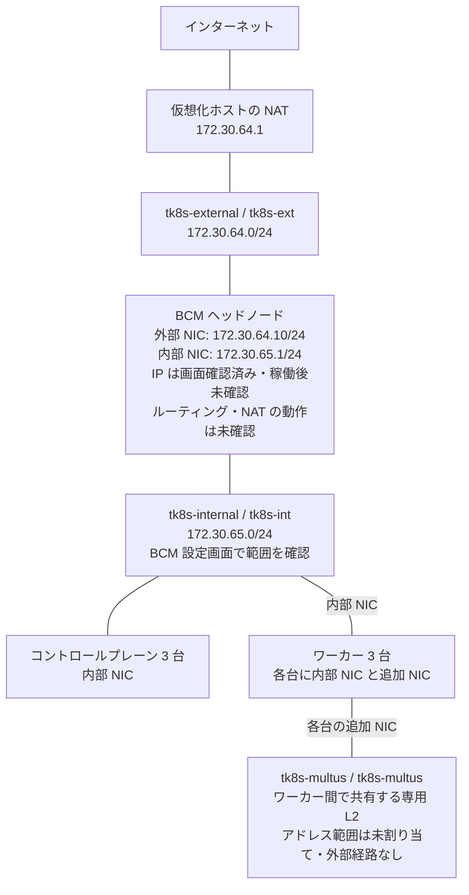

# 環境構成

本書は初期資料 `docs/vm-list.md` と `env.md` の環境情報、2026-09-22 に利用者から提供されたネットワーク構成、同日の BCM インストーラー画面、稼働後の読み取り専用調査、後続の利用者提供 libvirt 出力を整理したものです（整理日: 2026-09-22）。以下の計画・画面確認の記述は当時の記録として保持し、実測との差は [稼働後確認](#2026-09-22-の稼働後確認) に記載します。VM ごとの割り当ては [VM 一覧](vm-list.md)、実施状況は [検証状況](validation.md) を参照してください。

## 仮想化基盤

| 項目 | 構成 |
|---|---|
| 配置 | 全 7 VM を単一の物理ホストに配置 |
| ハイパーバイザー / 管理 | KVM / QEMU、libvirt |
| アーキテクチャ / VM タイプ | x86_64、Q35 |
| ファームウェア | UEFI、Secure Boot 無効 |
| NIC / ディスク | virtio |
| ディスクイメージ | qcow2、スパース形式 |
| ノードの起動順序 | コントロールプレーン・ワーカーの 6 台は PXE 優先 |
| GPU | 割り当てなし |

物理ホスト障害に対する冗長性はありません。複数のコントロールプレーン VM があっても、物理ホストを失うとクラスタ全体が停止する構成です。

## ネットワーク

構成計画の出典: 2026-09-22 の利用者提供情報（保存先: `input/20-network/2026-09-22-network-notes.md`）。この提供情報の IP・MAC アドレス、ホスト名、ネットワーク名・構成は、同日に利用者がインターネット公開可能な検証専用情報であることを確認しています。仮想ネットワークの作成日・設定操作の日時と KVM / QEMU / libvirt のバージョンは未記録です。

画面の出典: `input/30-bcm-install/` の 2026-09-22 のスクリーンショット。以下の S 番号は [BCM インストール記録の一次資料](bcm-installation.md#一次資料) に対応します。Networks（S14、S16）、Head node interfaces（S17）、Compute nodes interfaces（S18）、Summary（S22）、Show config の `network`（S24）と `headNode`（S29）を照合しました。時刻・パスは同記録に記載しています。

以下のネットワーク表は構成計画とインストーラー画面の記録です。ヘッドの稼働後の IP と NIC は [実機確認](#2026-09-22-の稼働後確認)、BCM / cp1 の実接続は [後続の libvirt 出力](#仮想化ホスト側の接続確認) で照合しました。**計算ノードの IP 表は設定計画・予約値です。node001 と node002 は 2026-09-23 に UP・SSH・予定 IP と外部 HTTPS を確認しました。残り 4 台は未確認です。** 進捗は [検証状況](validation.md) で管理します。

### 仮想ネットワークと接続

用途別に 3 つの仮想ネットワークを設けています。NIC はすべて virtio で、BCM ヘッドノードと各ワーカーに 2 本、各コントロールプレーンに 1 本、合計 11 本を割り当てています。

| ネットワーク名 | ホスト側ブリッジ | サブネット | 接続対象 | 用途 | BCM インストーラーでの表示 |
|---|---|---|---|---|---|
| `tk8s-external` | `tk8s-ext` | `172.30.64.0/24` | BCM ヘッドノード | 管理・インターネット接続 | `externalnet` に同じ範囲を設定。`DHCP` はチェックなし（S16、S24） |
| `tk8s-internal` | `tk8s-int` | `172.30.65.0/24` | 全 7 VM | PXE・クラスタ内部通信 | `internalnet` に同じ範囲を設定（S14、S24） |
| `tk8s-multus` | `tk8s-multus` | 未割り当て | ワーカー 3 台 | Multus のセカンダリネットワーク検証 | 対応する設定は保存画面では未確認 |

BCM のネットワーク名はインストーラー上の論理名です。この表の用途・サブネットの一致は、ゲスト NIC と仮想ネットワークの実接続を照合した結果ではありません。

- `tk8s-external`: 仮想化ホスト側 IP は `172.30.64.1`。libvirt の NAT を使用します。
- `tk8s-internal`: 仮想化ホスト側 IP・物理 NIC 接続を持たない専用 L2 です。ゲスト側サブネットは画面でも確認しましたが、稼働後の反映は未確認です。
- `tk8s-multus`: 仮想化ホスト側 IP・物理 NIC 接続・外部経路を持たない、ワーカー間で共有する専用 L2 です。
- いずれのネットワークも **libvirt 側の DHCP・DNS サービスは提供しません**。内部ネットワークの DHCP・PXE は BCM ヘッドノードで提供する計画です。

### IP アドレス計画

表の識別名は [VM 一覧](vm-list.md) の VM 名に対応します。提供資料では「ホスト名」とされていますが、ゲスト OS 内のホスト名・BCM 管理上のノード名への反映は未確認です。ヘッドノードの 2 アドレスは S17、S22、S29 に一致する表示があります。各ノードについては割り当て結果がないため、既存の予約値を維持します。

| VM 名 | 管理・外部接続用 | PXE・クラスタ内部用 | Multus 用 |
|---|---|---|---|
| `tk8s-bcm` | `172.30.64.10/24` | `172.30.65.1/24` | 接続なし |
| `tk8s-cp1` | 接続なし | `172.30.65.11/24` | 接続なし |
| `tk8s-cp2` | 接続なし | `172.30.65.12/24` | 接続なし |
| `tk8s-cp3` | 接続なし | `172.30.65.13/24` | 接続なし |
| `tk8s-worker1` | 接続なし | `172.30.65.21/24` | NIC 接続済み・IP 未設定 |
| `tk8s-worker2` | 接続なし | `172.30.65.22/24` | NIC 接続済み・IP 未設定 |
| `tk8s-worker3` | 接続なし | `172.30.65.23/24` | NIC 接続済み・IP 未設定 |

### ゲートウェイ・DNS・DHCP の計画と画面確認

| 項目 | 計画値 | 画面で確認できた内容・状態 |
|---|---|---|
| BCM のデフォルトゲートウェイ | `172.30.64.1` | S16、S22、S24 で計画値と一致 |
| BCM の外部 DNS | `1.1.1.1` | Nameservers は S06 と S22 で空欄。計画値の入力・反映は未確認 |
| 各ノードのデフォルトゲートウェイ | `172.30.65.1`（BCM ヘッドノード） | S14 の Gateway は未入力。画面説明では既定でヘッドノードを使用。S24 の内部ネットワークは `gateway: null`。ノードへの反映は未確認 |
| 内部ネットワークの DHCP・PXE 提供元 | BCM ヘッドノード | `Management network` と `Bootable network` は S14 で選択済み。S24 でも対応する値が `true`。サービス稼働は未確認 |
| DHCP 動的割り当て範囲 | `172.30.65.100`～`172.30.65.199` | 当初の候補と一致する値を S14 の入力欄と S24 の `dynamicrangestart`・`dynamicrangeend` で確認。稼働後の範囲は未確認 |
| 各ノードの DNS | BCM 導入時に設定 | 割り当て結果は未確認 |
| Multus 用のアドレス管理 | 後続の CNI・IPAM 設定で決定 | 未定 |

外部ネットワークは S11・S15 では DHCP が選択されていましたが、後続の S16 では静的設定に変わっています。Summary の Nameservers はその後も空欄であるため、外部 DNS の計画値が設定されたとは扱いません。内部・外部ネットワークの MTU はそれぞれ S14・S16 で `1500` と表示されています。

S18 の Compute nodes interfaces は `BOOTIF` / `internalnet` / `IP offset: 0.0.0.10` です。画面の連続割り当ての説明に従えば、6 台の範囲は `172.30.65.11`～`172.30.65.16` と推定され、ワーカーの予約値とは一致しません。これは入力値からの推定であり、ノードごとの生成結果・VM 対応・MAC 登録は未確認です。予約値を推定値へ置き換えず、導入後に生成されたノード一覧と照合し、既存の IP 計画に合わせる方法を確認します。

### NIC と MAC アドレスの対応

以下は作成済み NIC 接続として提供された対応表です。BCM の 2 行は、同日後続の [libvirt 出力](#仮想化ホスト側の接続確認) に基づき当初資料から訂正しました。cp1 の内部 MAC も同出力で照合済みです。cp2 は [9 月 23 日の提供ログ](#2026-09-23-cp2-の起動前構成確認) で照合しました。他のノードは当初の提供情報を保持しています。

| VM 名 | 接続ネットワーク | MAC アドレス |
|---|---|---|
| `tk8s-bcm` | `tk8s-external` | `52:54:00:65:00:01` |
| `tk8s-bcm` | `tk8s-internal` | `52:54:00:64:00:10` |
| `tk8s-cp1` | `tk8s-internal` | `52:54:00:65:00:02` |
| `tk8s-cp2` | `tk8s-internal` | `52:54:00:65:00:03` |
| `tk8s-cp3` | `tk8s-internal` | `52:54:00:65:00:04` |
| `tk8s-worker1` | `tk8s-internal` | `52:54:00:65:00:05` |
| `tk8s-worker1` | `tk8s-multus` | `52:54:00:66:00:01` |
| `tk8s-worker2` | `tk8s-internal` | `52:54:00:65:00:06` |
| `tk8s-worker2` | `tk8s-multus` | `52:54:00:66:00:02` |
| `tk8s-worker3` | `tk8s-internal` | `52:54:00:65:00:07` |
| `tk8s-worker3` | `tk8s-multus` | `52:54:00:66:00:03` |

ヘッドノードの入力画面（S17）と Show config（S29）では次の対応を確認しました。IP アドレスは [IP アドレス計画](#ip-アドレス計画) のヘッドノード行と一致します。

| インストーラーのインターフェイス | BCM ネットワーク | 用途 | Show config の `provisioning` |
|---|---|---|---|
| `enp1s0` | `internalnet` | PXE・クラスタ内部 | `true` |
| `enp2s0` | `externalnet` | 管理・外部接続 | `false` |

これらの画面には MAC アドレスがないため、画面整理時点ではゲスト内インターフェイス名との照合は未確認でした。同日夜のヘッド実機調査と後続の [libvirt 出力](#仮想化ホスト側の接続確認) により、BCM の NIC 名・MAC・接続先の対応を照合しました。cp1 との実際の DHCP 交換・疎通は未確認です。

### 通信経路の計画

BCM ヘッドノードでルーティング・NAT を設定した後の外部通信経路を示します。libvirt 側の NAT 構成は提供情報に基づきますが、BCM 側の設定反映とノードからの外部疎通は未確認です。Multus の追加 NIC は外部通信経路とは別の専用 L2 に接続します。

### 検証上の役割と未確定事項

- **PXE**: コントロールプレーンとワーカーの 6 台は内部 NIC から優先起動する構成です。OS 導入後も同じ NIC をクラスタ通信に使用する計画です。
- **Multus**: ワーカーの追加 NIC を macvlan などの親インターフェイスとして利用する想定です。追加 NIC の PXE ROM は無効との提供情報です。採用する CNI・IPAM とアドレス範囲は未定で、L2 と NIC の作成は Multus の導入・通信検証完了を示しません。
- **TopoLVM**: 各ワーカーのローカルディスクを使用するため、専用ストレージネットワークは設けていません。
- **Kubernetes**: Pod CIDR・Service CIDR は未決定です。外部・内部ネットワークと Multus 用アドレス範囲、および Pod CIDR と Service CIDR 相互の重複を避けて確定します。

## ストレージ

各ワーカーには、OS 用ディスクとは別に **256 GiB の空ディスク**を追加しています。QEMU で追加ディスクを認識したことは初期資料に記録されています。

今後、ゲスト OS 内で追加ディスクを確認し、LVM のボリュームグループを作成して TopoLVM から利用する計画です。LVM 初期化、TopoLVM の導入、ボリュームの動的割り当ては未実施です。

デバイス名、ボリュームグループ名、StorageClass 名は未記録です。実作業時に OS 用ディスクと追加ディスクの対応を確認してから確定します。

## ソフトウェアと設定の確定状況

`input/10-bcm-installer-manual/` に BCM の製品資料と `bcm-11.0-ubuntu2404.iso.md5` が保存されています。ファイル名だけではインストール済みバージョンや ISO の整合性確認の完了を判断できません。資料の版は [製品資料](references.md)、画面から読み取れる導入情報は [BCM インストール記録](bcm-installation.md) を参照してください。

| 項目 | 今後記録・確認する内容 |
|---|---|
| 物理ホスト | OS、CPU、メモリ、空き容量、KVM / QEMU / libvirt のバージョン |
| 仮想ネットワーク | 提供されたネットワーク名・ブリッジ名・NIC 接続・MAC アドレスと実設定の照合。構成値は [ネットワーク](#ネットワーク) を参照 |
| ゲストの識別 | VM 名・ゲスト OS 内ホスト名・BCM ノード名の対応、MAC とゲスト内 NIC 名の対応 |
| ネットワーク設定 | 画面入力の稼働後の反映、外部 DNS の計画と空欄表示の差、ノードの連続 IP 割り当てと予約値の差、DHCP 範囲・ノード DNS の実設定、DHCP・PXE・ルーティング・NAT と疎通結果 |
| BCM / OS | インストール後の BCM・OS のバージョンと必要なライセンスの状態 |
| Kubernetes | 導入バージョン、コントロールプレーン・etcd の配置、コンテナランタイム、基本 CNI、API エンドポイント、Pod / Service CIDR |
| Multus | 導入バージョン、セカンダリネットワークの接続方式と IP 割り当て方式 |
| TopoLVM | 導入バージョン、追加ディスクのデバイス名、VG 名、StorageClass と容量 |

## 2026-09-22 の稼働後確認

BCM ヘッドノード上で同日 22 時台（JST）に読み取り専用で確認しました。証跡は `input/40-bcm-pxe/2026-09-22-headnode-check.txt`。この直接調査では物理ホストと計算ノードは未確認でした。後続の利用者提供 libvirt 出力との照合は [下記](#仮想化ホスト側の接続確認) に追記しました。以下は当初計画と実測の比較です。

| 項目 | 実測 |
|---|---|
| OS / カーネル | Ubuntu 24.04.4 LTS / `6.8.0-106-generic` |
| BCM | `versioninfo`: Cluster Manager 11.0、CMDaemon 3.1、Build Index 165270 |
| パッケージ | `cmdaemon=11.0-165270-cm11.0-14a0291f4f`、`cm-setup=11.0-124257-cm11.0-7f8393643d`。ISO / インストーラーの版表示とは区別 |
| ヘッドのリソース | 8 vCPU、メモリ約 31 GiB 表示、`vda` 512 GiB。VM 割り当てと整合 |
| ヘッドのディスク | `vda1` 1 GiB `/boot`、`vda2` 100 MiB EFI、`vda3` 16 GiB swap、`vda4` 約 494.9 GiB XFS。調査時 `/` 空き約 457 GiB |
| ソフトウェアイメージ | `default-image`、`/cm/images/default-image`、カーネル `6.8.0-106-generic`、ロックなし |
| カテゴリ | `default`。新規ノード `FULL`、通常 `AUTO`。レイアウトは複数の blockdev 候補、EFI 100M、swap 16G、残り XFS `/` |
| Codex CLI | `codex-cli 0.155.1` を実行確認 |
| SSH 公開鍵の設置 | `authorized_keys` の存在・非空を確認。ディレクトリ 700、ファイル 600。鍵認証での別接続と計算ノードへの配布は未検証 |

稼働中の NIC は次の対応です。当初の利用者提供資料とは内部・外部の対応が逆でしたが、後続の [libvirt 出力](#仮想化ホスト側の接続確認) がこの実測と一致したため、上の MAC 表を訂正しました。現在の接続に合わせて BCM の NIC 設定を交換する必要はありません。過去に接続を変更した時刻・操作は未記録です。

| ゲスト NIC | 実測 MAC | 実測 IP / BCM 用途 | 当初資料の同 MAC の用途 |
|---|---|---|---|
| `enp1s0` | `52:54:00:64:00:10` | `172.30.65.1/24`、`internalnet`、provisioning、DHCP 待受 | 外部 |
| `enp2s0` | `52:54:00:65:00:01` | `172.30.64.10/24`、`externalnet` | 内部 |

- デフォルトゲートウェイは `172.30.64.1`、`enp2s0` 経由。ping 2 回成功。
- `internalnet` の動的範囲は計画どおり `.100`～`.199`、`nodebooting=yes`、`managementallowed=yes`、`lockdowndhcpd=no`。
- OS の DNS はローカルリゾルバー経由で `127.0.0.1` を参照し、BCM の BIND に明示的な forwarder はありません。`1.1.1.1` の固定設定は確認できませんが、外部名 `docs.nvidia.com` の解決は成功しました。
- NTP は外部 peer を同期先に選択。IPv4 forwarding は 1、内部サブネットから `enp2s0` への MASQUERADE ルールあり。計算ノードからの通信は未検証。

既存の BCM ノード定義と VM 対応は以下です。9 月 22 日の利用者操作で **`node001` と `tk8s-cp1` の MAC 対応は登録済み**。同日の再照会では残る 5 台は未登録でした。9 月 23 日の後続共有で node002 の MAC 登録も確認したため、表の次の対応を更新しています。内部 MAC と目標 IP は上の [IP 計画](#ip-アドレス計画)・[MAC 表](#nic-と-mac-アドレスの対応) を正とし、実際の libvirt 設定と照合して登録します。

| 現在の BCM 定義 | 現在の IP | 対応させる VM（計画） | 次の対応 |
|---|---|---|---|
| `node001` | `172.30.65.11` | `tk8s-cp1` | 9 月 23 日に初回展開・UP・SSH・OS 内部・外部 HTTPS 確認済み |
| `node002` | `172.30.65.12` | `tk8s-cp2` | 9 月 23 日の提供ログで UP・SSH・OS 内部・外部 HTTPS を確認。[結果と残課題](#2026-09-23-node002-の起動後確認) |
| `node003` | `172.30.65.13` | `tk8s-cp3` | 最初の 1 台の確認後に MAC 登録・展開 |
| `node004` | `172.30.65.14` | `tk8s-worker1` | 同上、IP を計画の `.21` に変更 |
| `node005` | `172.30.65.15` | `tk8s-worker2` | 同上、IP を計画の `.22` に変更 |
| `node006` | `172.30.65.16` | `tk8s-worker3` | 同上、IP を計画の `.23` に変更 |

ライセンス制約・サービス状態・展開結果は [検証状況](validation.md)、具体的な未実行手順は [PXE・OS 展開手順](bcm-pxe-provisioning.md) に記載します。ヘッドの実ホスト名、ドメイン、ライセンス識別情報、鍵の内容は公開文書へ転記しません。

### 仮想化ホスト側の接続確認

2026-09-22 に利用者が提供した `virsh` の出力を確認しました。実行時刻は未記録で、エージェントが物理ホストへ接続して再実行した結果ではありません。匿名化転記は `input/40-bcm-pxe/2026-09-22-libvirt-preflight-redacted.txt`。

- `domiflist tk8s-bcm` は内部 MAC が `tk8s-internal`、外部 MAC が `tk8s-external` に接続されていることを示し、上のヘッド実測と一致します。稼働中の接続を確認した範囲であり、`--inactive` による永続構成との照合は未実施です。
- `domiflist tk8s-cp1` は計画の内部 MAC が同じ `tk8s-internal` に接続される定義であることを示します。`domstate` は `shut off`、インターフェイスの `-` 表示はこの停止状態と整合します。
- `net-dumpxml tk8s-internal` はブリッジ `tk8s-int`、`dns enable='no'`、IP・DHCP・forward の各定義なし。内部ネットワークで libvirt が DHCP を提供しない設定を確認しました。他の DHCP サーバーの不存在や実際の DHCP 交換を確認したものではありません。
- `domblklist tk8s-cp1 --details` は `file / disk / vda` の 1 台で、対応する VM イメージ名を確認しました。物理ホスト上の親パスは非掲載。後続の `domblkinfo` の Capacity は 137438953472 bytes = 128 GiB。Allocation 200704 bytes、Physical 198656 bytes は qcow2 の割り当て・物理サイズ表示であり、仮想容量や未使用の証明とは区別します。UEFI・Secure Boot・PXE 起動順序は今回の出力にはなく、以前の構成記録を引き継ぐ範囲です。

後続の登録・swap 調査の証跡は `input/40-bcm-pxe/2026-09-22-cp1-swap-review.txt`。`node001` の MAC は `52:54:00:65:00:02`、BOOTIF は `172.30.65.11` / `internalnet`、状態は `DOWN` と再確認しました。カテゴリ継承の swap 16G は変更されていません。この時点では初回展開前でした。翌日の結果は [起動後確認](#2026-09-23-node001-の起動後確認) を参照してください。ワーカーのディスク識別と残りの VM の実接続照合は別途必要です。物理ホスト名・ユーザー名・ネットワーク UUID・ブリッジの MAC は公開文書へ転記しません。

## 2026-09-23: node001 の起動後確認

利用者の PXE 画像・`device list` 出力、00:10～00:11 JST のヘッド上の再照会と、00:17 JST の [SSH による確認](bcm-pxe-provisioning.md#2026-09-23-ホスト名による-ssh-と-os-内部の確認) に基づきます。手順・画像ごとの確認範囲・証跡は [初回展開記録](bcm-pxe-provisioning.md#2026-09-23-node001-の初回-pxeos-展開記録) を参照。

| 項目 | 確認結果 |
|---|---|
| VM / BCM 名 | `tk8s-cp1` / `node001`。登録 MAC と node-installer の表示を照合 |
| ネットワーク | node-installer の `enp1s0` は `172.30.65.11/24`。BCM の BOOTIF は `internalnet` |
| OS / カーネル | 起動後画面は Ubuntu 24.04.4 LTS / `6.8.0-106-generic` x86_64 |
| 認識リソース | 起動後画面は CPU 4 論理プロセッサ、メモリ 16 GiB、virtio ディスク 1 台 128G。VM 割り当てと整合 |
| BCM 状態 | `UP`。残り 5 台は MAC 未登録・`DOWN, unassigned` |
| SSH | ヘッドの root から `node001` 指定で成功。既存 ED25519 ホスト鍵と一致、公開鍵認証で root 接続。先の IP 指定失敗とは区別 |
| OS ディスク | `vda` 128G、`vda1` 100M vfat `/boot/efi`、`vda2` 16G swap、`vda3` 111.9G XFS `/`。`findmnt` でもルートの `/dev/vda3` を確認 |
| swap | `/dev/vda2` が有効、使用量 0B。`fstab` は UUID で当該 swap を指定。`swapon` に swap ファイルは表示されなかった |
| 起動後の経路・通信 | `enp1s0` は `172.30.65.11/24`、デフォルト経路は `172.30.65.1`。`docs.nvidia.com` の名前解決と IPv4 HTTPS の HTTP 200 を確認 |
| ノードの失敗サービス | `systemctl --failed` は 0 件。ヘッド側の既知の失敗ユニットとは別の結果 |
| 未確認 | 再起動後の状態、Kubernetes 構築後の swap 無効化、他の 5 台の起動後状態 |

## 2026-09-23: cp2 の起動前構成確認

利用者提供の `virsh` 出力を確認した結果。受領日は 2026-09-23（JST）、実行日時・終了コードと実ホストの libvirt / QEMU パッケージ版は未記録。原本は `input/60-install-by-pxe/2026-09-23-cp2-libvirt-preflight.txt`。Codex による実環境の再照会ではない。操作順と後続の MAC 登録は [実施記録](bcm-pxe-provisioning.md#2026-09-23-node002-の事前確認mac-登録と-installing-表示)、進捗は [検証状況](validation.md) を参照する。

| 項目 | 提供出力で確認できた構成 |
|---|---|
| 電源状態 | `domstate` の採取時点は `shut off`。後続の BCM 一覧とは採取時点が異なる |
| 内部 NIC | virtio 1 本、`tk8s-internal`、MAC は上の対応表と一致 |
| OS ディスク | qcow2 / virtio の `vda` 1 台。Capacity 137438953472 bytes = 128 GiB。追加ディスクの定義なし |
| CPU / メモリ | XML は 4 vCPU / 16777216 KiB = 16 GiB。VM 一覧と一致 |
| ファームウェア | XML は `firmware='efi'`、`secure-boot` / `enrolled-keys` は `enabled='no'`、loader は `secure='no'` |
| 起動順 | 内部 NIC の `boot order='1'`、OS ディスクの `boot order='2'`。UEFI メニューで実際に選ばれた項目は未記録 |
| 機種定義 | XML は `x86_64` / `pc-q35-10.2`。この文字列だけで QEMU パッケージ版を確定しない |

確認したのは `--inactive` による次回起動用の定義の提示範囲。添付末尾は `</devices>` までで `</domain>` がなく、XML 全体の有効性は判定していない。この起動前確認の時点では OS 内部・疎通は未確認だった。後続の [起動後確認](#2026-09-23-node002-の起動後確認) でパーティション・NIC 名・疎通を確認した。実効 Secure Boot 状態は引き続き未確認。qcow2 の小さい Allocation / Physical 値や XML の説明欄だけでディスク内容が空であるとは断定しない。原本にある物理ホスト名・ユーザー名・実ストレージパス・UUID・VNC 待受アドレス・管理リポジトリの識別情報は公開文書へ転記しない。ヘッドの永続 NIC 構成の出力は今回含まれていない。

## 2026-09-23: node002 の起動後確認

利用者が BCM ヘッドから SSH 接続し、node002 内部で実行したコマンドの提供出力に基づく。受領日は 2026-09-23（JST）、実施日時と終了コードは未記録。HTTP 応答の Date は応答元の時刻であり、実行日時とは区別する。匿名化抜粋は `input/60-install-by-pxe/2026-09-23-node002-os-check-redacted.txt`、操作順は [実施記録](bcm-pxe-provisioning.md#2026-09-23-node002-の-ssh-と-os-内部の確認) を参照。Codex は実環境で再検証していない。

| 項目 | 提供ログで確認できた結果 |
|---|---|
| SSH / ホスト名 | `ssh root@node002` でログイン成功、`hostname` は node002。ED25519 ホスト鍵の known_hosts への新規保存表示あり。認証方式と指紋の別経路照合は未記録 |
| OS / カーネル | ログイン表示は Ubuntu 24.04.4 LTS / `6.8.0-106-generic` x86_64 |
| IP / 経路 | `enp1s0` は `172.30.65.12/24`、デフォルト経路は `172.30.65.1` 経由。予定と一致 |
| ディスク | vda 128G、vda1 100M vfat `/boot/efi`、vda2 16G swap、vda3 111.9G XFS `/`。findmnt も `/dev/vda3 xfs` を表示 |
| swap | `/dev/vda2` が有効、使用量 0B。Kubernetes 構築前の状態として保持 |
| 失敗サービス | `systemctl --failed` は 0 件 |
| 外部通信 | `docs.nvidia.com` の IPv4 名前解決と、`curl -4 -I` による HTTPS の HTTP/2 200 を確認 |
| 未確認 | 同期ログ・実際のインストールモード、fstab、再起動後、Kubernetes 構築後の swap 無効化。ディスク上のルート確認を PXE に依存しない起動の実証とはしない |

DNS 応答の実アドレス・別名、応答 Cookie・内部サービスの URL・不要な HTTP ヘッダーは公開文書へ転記しない。外部通信の確認は上記宛先への IPv4 HTTPS に限り、すべてのパッケージ配布元の到達性を保証しない。

## 検証用の認証情報

検証用パスワードの実値は公開文書に記載しません。初期資料 `env.md` の「機密としては扱わない」という指定だけでは、インターネット公開の許可とは扱いません。

- 検証用パスワード: `<PASSWORD>`（実値を除去したプレースホルダー）
- 適用するアカウント・ホスト: 初期資料には記載なし。

ネットワーク構成についての公開確認は、認証情報の公開許可を含みません。
